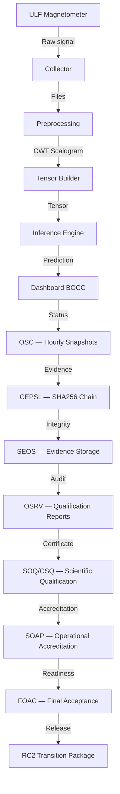
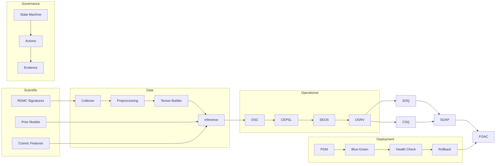

# Knowledge Graph — PIMES System Architecture

**Version:** v2.0.0-rc2-freeze

## Data Flow

## Component Dependency

## Validation Chain

| Stage | Input | Output | Evidence |
|-------|-------|--------|----------|
| 1. Collector | Raw ULF | Files | OSC snapshot |
| 2. Preprocessing | Files | CWT scalogram | PSEP dual execution |
| 3. Tensor | Scalogram | Tensor | Golden dataset |
| 4. Inference | Tensor + Prior | Prediction | Runtime log |
| 5. Dashboard | Prediction | Visualization | API endpoints |
| 6. OSC | Dashboard state | Hourly snapshot | Append-only log |
| 7. CEPSL | OSC state | SHA256 lock | Archive hash |
| 8. SEOS | Evidence | Stored | UUID + SHA256 |
| 9. OSRV | Evidence | Reports | 10 qualification reports |
| 10. SOQ/CSQ | Reports | Score | Qualification certificate |
| 11. SOAP | Score | Accreditation | Final certificate |
| 12. FOAC | All above | Acceptance | Conditional GO |
