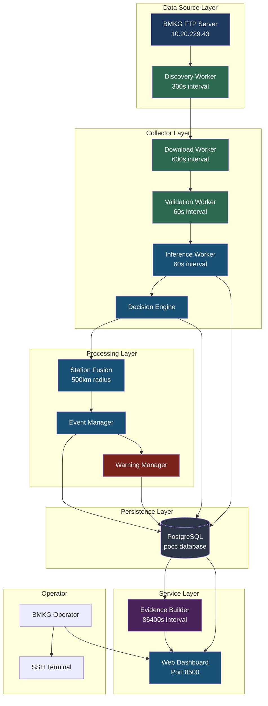
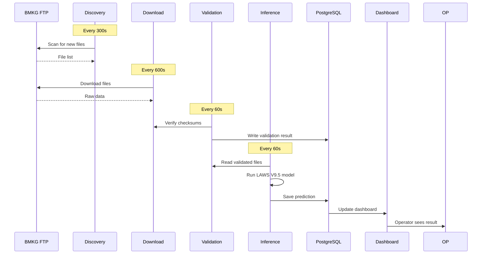
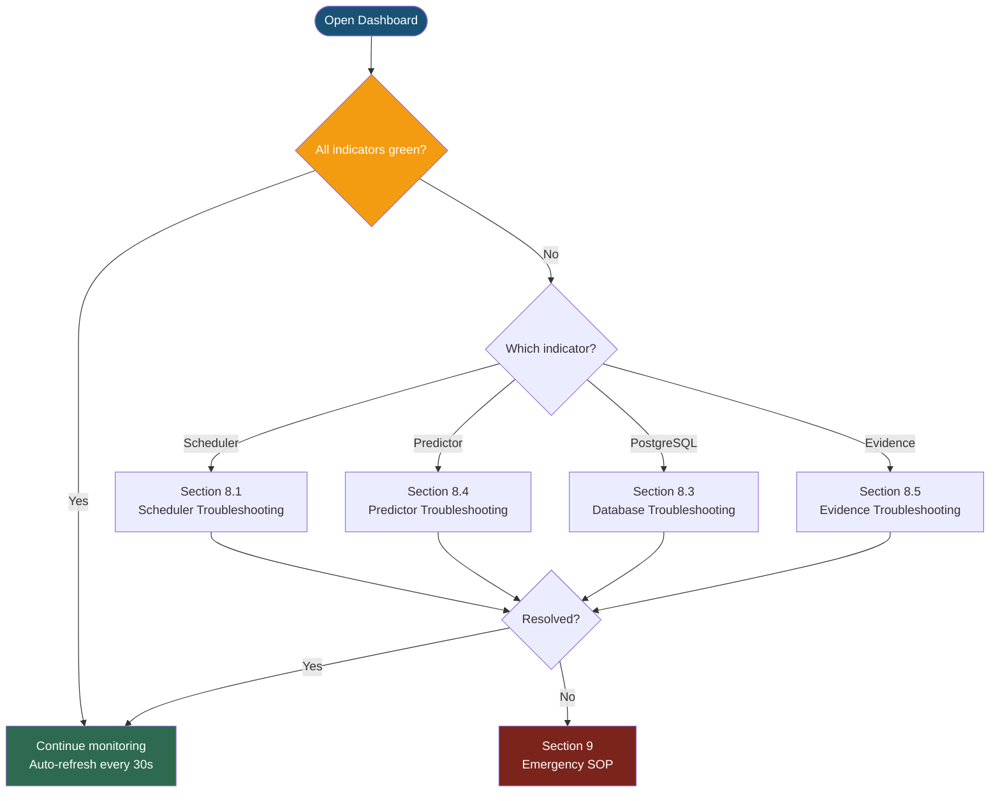
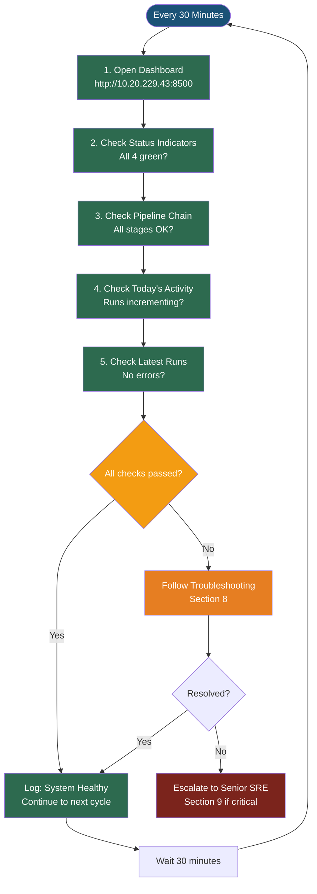
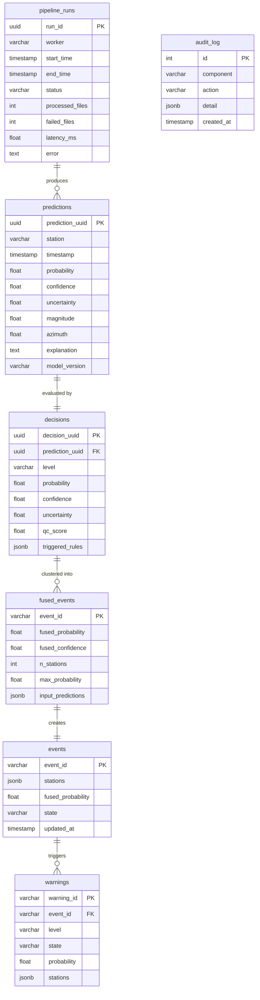
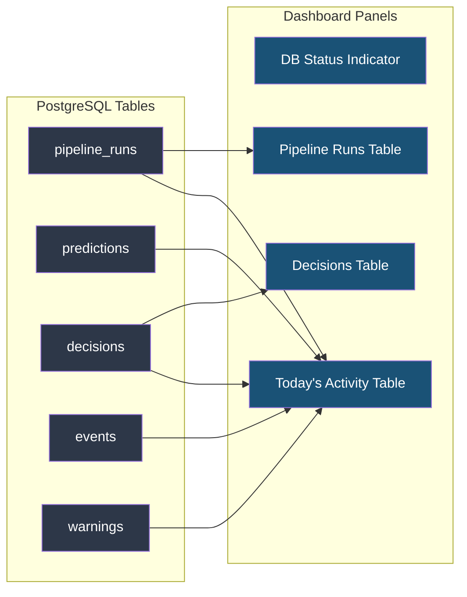
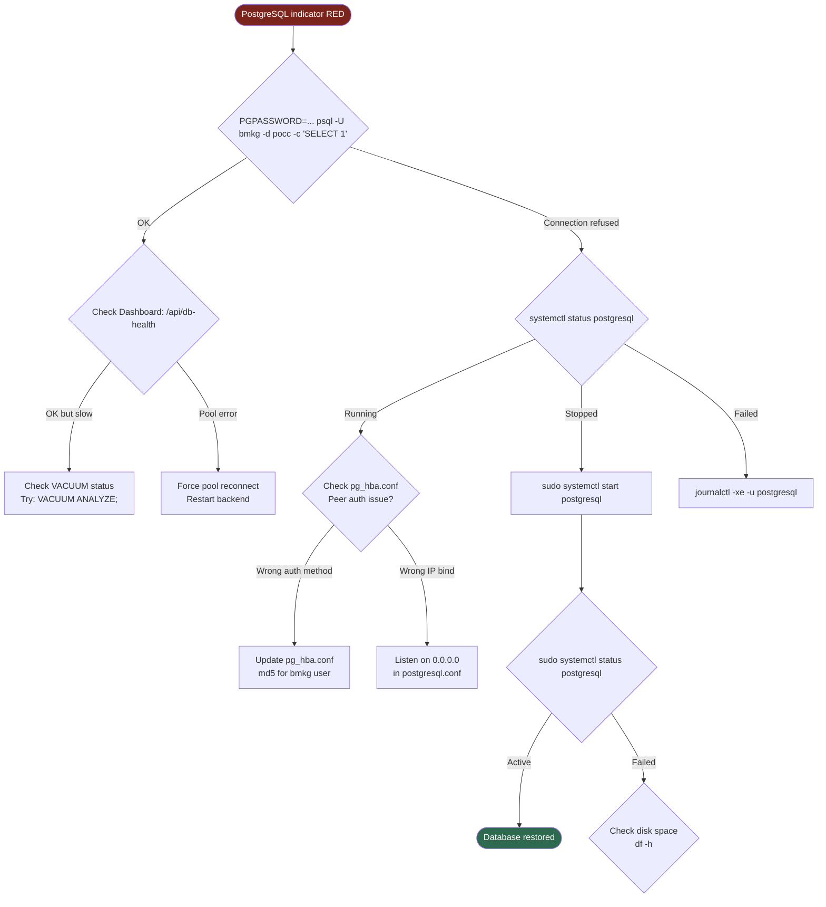
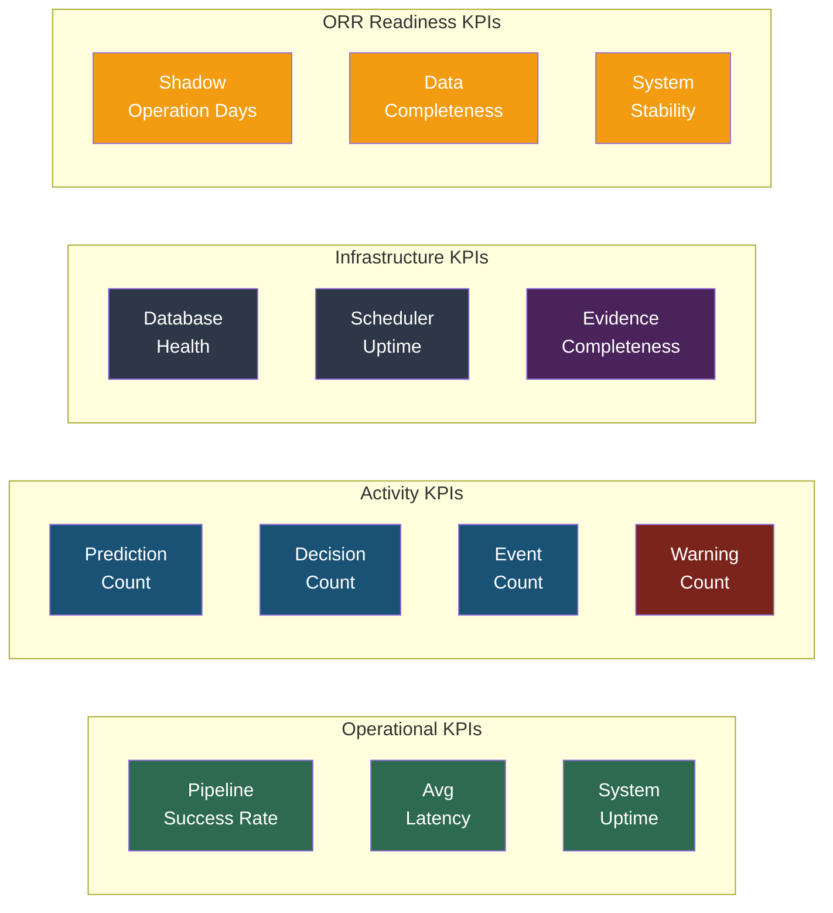
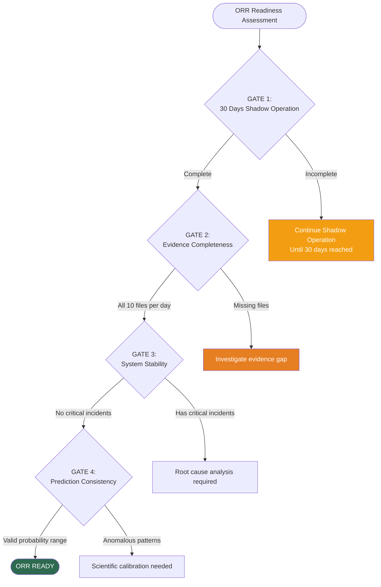

# LAWS V2 Operational Shadow
## Daily Operations Manual
### Version 1.0

---

> **Document Control**
>
> | Field | Value |
> |-------|-------|
> | Document ID | LAWS-V2-OPS-MANUAL-001 |
> | Version | 1.0 |
> | Classification | Operational — Internal Use |
> | Target Audience | BMKG Shift Operators |
> | System | LAWS V2 Operational Shadow — Earthquake Precursor Monitoring |
> | Last Updated | 2026-07-20 |
> | Author | Principal SRE / System Architect |

---

> [!IMPORTANT]
> **READ THIS FIRST**
>
> This manual describes the daily operation of the LAWS V2 Operational Shadow system.
> The system is currently running in **Operational Shadow Mode** — it processes data and generates predictions in parallel with the production pipeline but does **not** issue public warnings.
>
> All operators **must** read Section 1 (System Overview) before performing any operational task.
> In case of emergency, skip directly to **Section 9 — Emergency SOP**.

---

## Table of Contents

| Chapter | Title | Page |
|---------|-------|------|
| 1 | System Overview | 3 |
| 2 | Morning Operational Checklist | 8 |
| 3 | Dashboard Monitoring | 11 |
| 4 | Operational Monitoring Procedure | 15 |
| 5 | SSH Monitoring | 19 |
| 6 | Database Monitoring | 23 |
| 7 | Evidence Monitoring | 27 |
| 8 | Troubleshooting Decision Trees | 31 |
| 9 | Emergency SOP | 37 |
| 10 | Operational KPI Dashboard | 41 |
| 11 | ORR Readiness Checklist | 44 |
| 12 | Appendix | 47 |

---

## Chapter 1 — System Overview

### 1.1 Purpose

To provide BMKG operators with a complete understanding of the LAWS V2 Operational Shadow architecture, data flow, and component responsibilities.

### 1.2 When to Read

- **First shift** on the system (mandatory reading)
- **Annual refresher** training
- **After any architecture change**

### 1.3 Who Reads

All BMKG shift operators assigned to LAWS V2 monitoring.

### 1.4 System Architecture



> **Figure 1.1** — LAWS V2 Operational Shadow system architecture showing the complete data flow from BMKG FTP through all processing layers to the operator dashboard.

### 1.5 Component Summary

| # | Component | Function | Interval | Status Source |
|---|-----------|----------|----------|---------------|
| 1 | **Discovery Worker** | Scans BMKG FTP for new magnetometer data | 300s (5 min) | Manifest / Dashboard |
| 2 | **Download Worker** | Downloads discovered files to local storage | 600s (10 min) | Manifest / Dashboard |
| 3 | **Validation Worker** | Checksum + quality verification | 60s (1 min) | Manifest / Dashboard |
| 4 | **Inference Worker** | Runs LAWS V9.5 prediction model | 60s (1 min) | Manifest / Dashboard |
| 5 | **Decision Engine** | Evaluates predictions against 4 rules | Event-driven | Dashboard |
| 6 | **Station Fusion** | Clusters predictions by time + space | Event-driven | Dashboard |
| 7 | **Event Manager** | Manages event lifecycle | Event-driven | Dashboard |
| 8 | **Warning Manager** | Issues warnings when criteria met | Event-driven | Dashboard |
| 9 | **PostgreSQL** | Persistent storage for all artefacts | Always on | DB Health API |
| 10 | **Evidence Builder** | Daily evidence package export | 86400s (24h) | Summary JSON |
| 11 | **Web Dashboard** | Operator monitoring UI | Always on | Browser |

### 1.6 Data Flow Timeline



> **Figure 1.2** — Sequence diagram showing the timing of each worker cycle and data persistence.

### 1.7 Deployment Topology

| Component | Host | IP | Port | Technology |
|-----------|------|----|------|------------|
| Scheduler | Ubuntu Server | 10.20.229.43 | — | Python 3.11 |
| Backend API | Ubuntu Server | 10.20.229.43 | 8500 | FastAPI + Uvicorn |
| PostgreSQL | Ubuntu Server | 10.20.229.43 | 5432 | PostgreSQL 14 |
| Dashboard | Ubuntu Server | 10.20.229.43 | 8500 | Jinja2 + Bootstrap |
| Evidence Store | Ubuntu Server | 10.20.229.43 | — | JSON files |
| Model Runtime | Ubuntu Server | 10.20.229.43 | — | Python venv |

> **Table 1.2** — Deployment topology showing all components running on a single Ubuntu server.

---

## Chapter 2 — Morning Operational Checklist

### 2.1 Purpose

To ensure the LAWS V2 system is fully operational at the start of each shift.

### 2.2 When to Perform

- **Start of every shift** (07:00 AM and 19:00 PM WITA)
- **After any system restart**
- **After any maintenance window**

### 2.3 Who Performs

BMKG Shift Operator on duty.

### 2.4 Estimated Duration

5–10 minutes.

### 2.5 Morning Checklist

```
┌──────────────────────────────────────────────────────────┐
│  LAWS V2 — MORNING OPERATIONAL CHECKLIST                  │
│  Shift: ☐ 07:00–19:00 WITA   ☐ 19:00–07:00 WITA          │
│  Date: ______________  Operator: ______________            │
├──────────────────────────────────────────────────────────┤
│                                                           │
│  ☐ 1. Dashboard Online                                    │
│      → Open http://10.20.229.43:8500                      │
│      → Expected: Page loads, shows Operations Console     │
│                                                           │
│  ☐ 2. Scheduler Running                                   │
│      → Check indicator (top-left of dashboard)            │
│      → Expected: Green dot, "RUNNING"                     │
│      → Fallback: SSH → `ps aux | grep collector`          │
│                                                           │
│  ☐ 3. PostgreSQL Connected                                │
│      → Check indicator on dashboard                       │
│      → Expected: Green dot, "OK"                          │
│      → Fallback: SSH → psql health check                  │
│                                                           │
│  ☐ 4. Predictor Loaded                                    │
│      → Check indicator on dashboard                       │
│      → Expected: Green dot, "LAWS" or model name          │
│      → Fallback: SSH → check /api/predictor               │
│                                                           │
│  ☐ 5. Evidence Generated Today                            │
│      → Check Evidence section on dashboard                │
│      → Expected: Today's date shown                       │
│      → Fallback: SSH → ls evidence/latest/                │
│                                                           │
│  ☐ 6. No Critical Errors                                  │
│      → Check collector log for ERROR entries              │
│      → Expected: No CRITICAL or repeated FATAL errors     │
│                                                           │
│  ☐ 7. Pipeline Runs Increasing                            │
│      → Check Pipeline Runs table on dashboard             │
│      → Expected: Runs incrementing each 1-2 minutes       │
│                                                           │
│  ☐ 8. API Health Check                                    │
│      → curl http://10.20.229.43:8500/api/health           │
│      → Expected: {"status":"OK", ...}                     │
│                                                           │
├──────────────────────────────────────────────────────────┤
│                                                           │
│  FINAL STATUS:  ☐ ALL PASS  ☐ DEGRADED  ☐ CRITICAL       │
│                                                           │
│  If CRITICAL: Follow Section 9 — Emergency SOP            │
│  If DEGRADED: Note in shift log, troubleshoot per Ch. 8   │
│                                                           │
│  Signed: ___________________  Time: ________ WITA         │
│                                                           │
└──────────────────────────────────────────────────────────┘
```

> **Figure 2.1** — Morning Operational Checklist. Print and complete at the start of each shift.

### 2.6 Expected Result

After completing all 8 checks, the operator should see:
- All 4 status indicators on dashboard: **Green**
- Pipeline runs actively incrementing
- No error logs
- Evidence for today's date present

### 2.7 Failure Modes

| Check # | Failure Symptom | Action |
|---------|----------------|--------|
| 1 | Dashboard doesn't load | Restart backend (Section 8.2) |
| 2 | Scheduler not running | Restart scheduler (Section 8.1) |
| 3 | PostgreSQL down | Check PG service (Section 8.3) |
| 4 | Predictor not loaded | Check model file (Section 8.4) |
| 5 | No evidence today | Wait or force-run (Section 8.5) |
| 6 | Critical errors | Emergency SOP (Section 9) |
| 7 | Runs not incrementing | Check scheduler (Section 8.1) |
| 8 | API not responding | Restart backend (Section 8.2) |

---

## Chapter 3 — Dashboard Monitoring

### 3.1 Purpose

To provide operators with real-time visibility into system health, pipeline activity, and operational metrics through a single-pane-of-glass interface.

### 3.2 URL

**http://10.20.229.43:8500/**

### 3.3 Dashboard Layout

```
┌─────────────────────────────────────────────────────────────┐
│  LAWS V2 Operational Shadow        Time: 12:34:56 WITA      │
│                          Status: 🟢 OPERATIONAL              │
├─────────────────────────────────────────────────────────────┤
│                                                              │
│  ┌──────────┐  ┌──────────┐  ┌──────────┐  ┌──────────┐   │
│  │Scheduler │  │Predictor │  │PostgreSQL│  │ Evidence │   │
│  │   ●      │  │   ●      │  │   ●      │  │   ●      │   │
│  │ RUNNING  │  │ LAWS V9.5│  │   OK     │  │2026-07-20│   │
│  │1 instance│  │ loaded   │  │pool active│  │generated │   │
│  └──────────┘  └──────────┘  └──────────┘  └──────────┘   │
│                                                              │
├─ Pipeline Health ────────────────────────────────────────────┤
│                                                              │
│  [Discovery] → [Download] → [Validation] → [Inference]      │
│     OK           OK            OK             OK             │
│          → [Fusion] → [Event] → [Warning]                   │
│              OK         OK         OK                        │
│                                                              │
├─ Today's Activity ───────────────────────────────────────────┤
│                                                              │
│  Metric              Count     Status                        │
│  Pipeline Runs       57        52 / 57 OK                    │
│  Predictions         6         Active                        │
│  Decisions           6         Active                        │
│  Events              0         None                          │
│  Warnings            0         None                          │
│                                                              │
├─ Latest Pipeline Runs ───────────────────────────────────────┤
│  12:34:01  inference  SUCCESS  0 files  1.5ms                │
│  12:33:01  inference  SUCCESS  0 files  1.2ms                │
│  12:32:01  inference  SUCCESS  0 files  1.8ms                │
│  12:31:01  validation SUCCESS  5 files  789ms                │
│                                                              │
├─ Latest Decisions ───────────────────────────────────────────┤
│  12:34:01  TNG  WATCH   0.7234  4 rules                      │
│  12:33:01  MND  NORMAL  0.1234  2 rules                      │
│                                                              │
└─────────────────────────────────────────────────────────────┘
```

> **Figure 3.1** — LAWS V2 Operations Console layout showing all monitoring panels in a single view.

### 3.4 Indicator Color Codes

| Color | Meaning | Action Required |
|-------|---------|----------------|
| 🟢 Green | Healthy | None — continue monitoring |
| 🟡 Yellow | Degraded | Investigate within 30 minutes |
| 🔴 Red | Critical | Immediate investigation required |
| ⚫ Gray | Unknown | Check connectivity |

### 3.5 Dashboard Auto-Refresh

The dashboard refreshes **every 30 seconds** automatically. No manual refresh needed.

### 3.6. What to Look For

| Panel | Normal | Warning | Critical |
|-------|--------|---------|----------|
| Scheduler | Green "RUNNING" | Yellow "STANDBY" | Red "STOPPED" or missing |
| Predictor | Green model name | Yellow "FALLBACK" | Red "ERROR" |
| PostgreSQL | Green "OK" | Yellow slow query | Red "DOWN" |
| Evidence | Green today's date | Yellow yesterday's date | Red missing |
| Pipeline Runs | All stages green | One stage yellow | Any stage red |
| Today's Activity | Runs incrementing | No activity 5min+ | No activity 15min+ |

### 3.7 Operating Procedures from Dashboard



> **Figure 3.2** — Dashboard monitoring decision flow: what to do when indicators deviate from normal.

---

## Chapter 4 — Operational Monitoring Procedure

### 4.1 Purpose

To define the systematic monitoring routine that operators follow throughout each shift.

### 4.2 When to Perform

- **Every 30 minutes** during active shift
- **Immediately after** any alert or unusual event

### 4.3 Who Performs

BMKG Shift Operator.

### 4.4 Monitoring Cycle



> **Figure 4.1** — Operational monitoring cycle flow. Complete this loop every 30 minutes.

### 4.5 Standard Operating Procedure

#### Step 1: Open Dashboard
```
Action:   Open web browser to http://10.20.229.43:8500
Expected: Operations Console loads within 5 seconds
Check:    Page title shows "LAWS V2 — Operations Console"
```

#### Step 2: Check Status Indicators
```
Action:   Visually inspect 4 status indicator cards
Expected: All 4 show green dots and healthy status text
          Scheduler  → RUNNING
          Predictor  → model name (e.g. LAWS V9.5)
          PostgreSQL → OK
          Evidence   → today's date
```

#### Step 3: Check Pipeline Chain
```
Action:   Visually inspect pipeline chain visualization
Expected: All 7 stages show green background (stage-ok)
          Stage order: Discovery → Download → Validation → Inference
                       → Fusion → Event → Warning
```

#### Step 4: Check Today's Activity
```
Action:   Read Today's Activity table
Expected: Pipeline Runs count incrementing from previous check
          Success rate > 80%
          No unexpected zeros in predictions/decisions
```

#### Step 5: Check Latest Runs
```
Action:   Scroll Latest Pipeline Runs table
Expected: Most recent run timestamp < 5 minutes old
          Status all "SUCCESS"
          Latency consistent (inference ~1-20ms, validation ~500-1500ms)
```

### 4.6 Monitoring Log

```
┌──────────────────────────────────────────────────────────────┐
│  LAWS V2 — SHIFT MONITORING LOG                               │
│  Operator: ______________  Date: ______________                │
├────────────┬──────────┬──────────┬──────────┬─────────────────┤
│  Time      │ Sched    │ DB       │ Pipeline │ Notes           │
│  (WITA)    │ Status   │ Status   │ Health   │                 │
├────────────┼──────────┼──────────┼──────────┼─────────────────┤
│  07:00     │ RUNNING  │ OK       │ ALL PASS │ Shift start     │
│  07:30     │ RUNNING  │ OK       │ ALL PASS │                  │
│  08:00     │ RUNNING  │ OK       │ ALL PASS │                  │
│  08:30     │ RUNNING  │ OK       │ ALL PASS │                  │
│  09:00     │ RUNNING  │ OK       │ ALL PASS │                  │
│  ...       │ ...      │ ...      │ ...      │ ...              │
├────────────┴──────────┴──────────┴──────────┴─────────────────┤
│                                                               │
│  END OF SHIFT SUMMARY                                          │
│  Total Checks: ___  Pass: ___  Fail: ___                       │
│  Incidents: __________________________________                 │
│  Handover Notes: ____________________________                 │
│                                                               │
│  Signed (Outgoing): ___________  Time: _____                   │
│  Signed (Incoming): ___________  Time: _____                   │
│                                                               │
└──────────────────────────────────────────────────────────────┘
```

> **Figure 4.2** — Shift monitoring log. Record at each 30-minute check interval.

### 4.7 Escalation Matrix

| Severity | Response Time | Escalation Path |
|----------|---------------|-----------------|
| **LOW** (single worker delay) | Within 60 minutes | Log in shift notes |
| **MEDIUM** (predictor fallback) | Within 30 minutes | Notify SRE on-call |
| **HIGH** (database down) | Within 10 minutes | Senior SRE + System Architect |
| **CRITICAL** (data loss) | Immediate | Full emergency response (Section 9) |

---

## Chapter 5 — SSH Monitoring

### 5.1 Purpose

To enable operators to perform direct system inspection via SSH when the dashboard is unavailable or deeper investigation is needed.

### 5.2 When to Use

- Dashboard is unreachable
- Need to view detailed logs
- Need to restart a service
- Need to verify process status

### 5.3 Credentials

> [!WARNING]
> **Credential Security**
>
> - SSH password: `precursor@admin2026!`
> - Database password: `Precursor@2026!`
> - These are **production credentials** — do not share outside BMKG operations team
> - Rotate passwords every 90 days per BMKG security policy

### 5.4 SSH Connection

```bash
# Step 1: Connect to the server
ssh bmkg@10.20.229.43

# Step 2: You should see:
# Welcome to Ubuntu 22.04.3 LTS
# bmkg@laws-server:~$
```

```
┌─────────────────────────────────────────────────────────────┐
│                                                             │
│  Terminal — bmkg@10.20.229.43                              │
│  ┌─────────────────────────────────────────────────────┐   │
│  │ Welcome to Ubuntu 22.04.3 LTS                        │   │
│  │                                                      │   │
│  │ bmkg@laws-server:~$ _                                │   │
│  └─────────────────────────────────────────────────────┘   │
│                                                             │
│  Figure 5.1 — SSH terminal after successful login           │
│                                                             │
└─────────────────────────────────────────────────────────────┘
```

### 5.5 Essential Commands

#### Process Status
```bash
# Check scheduler
ps aux | grep 'python -m collector' | grep -v grep

# Expected output:
# bmkg  45643  0.1  0.5  ... python -m collector

# Check backend API
ps aux | grep uvicorn | grep -v grep

# Expected output:
# bmkg  1232  0.2  0.3  ... uvicorn backend.main:app
```

#### Real-time Logs
```bash
# Scheduler log (live)
tail -f /opt/pimes/pocc/collector.log

# Backend log (live)
tail -f /tmp/backend.log

# Last 50 lines with timestamps
tail -50 /opt/pimes/pocc/collector.log

# Search for errors
grep ERROR /opt/pimes/pocc/collector.log | tail -20

# Count errors today
grep -c "ERROR" /opt/pimes/pocc/collector.log
```

#### Log Output Example
```
┌─────────────────────────────────────────────────────────────┐
│  bmkg@laws-server:~$ tail -f /opt/pimes/pocc/collector.log │
├─────────────────────────────────────────────────────────────┤
│  2026-07-20 12:25:49 [inference] INFO Run cycle started     │
│  2026-07-20 12:25:49 [db] INFO PG pool ready (host=localhost)│
│  2026-07-20 12:25:49 [inference] INFO No certs to process   │
│  2026-07-20 12:25:49 [inference] INFO Run cycle complete    │
│  2026-07-20 12:25:57 [validation] INFO validation complete  │
│  2026-07-20 12:26:01 [inference] INFO Run cycle started     │
│  2026-07-20 12:26:01 [inference] INFO No certs to process   │
│  2026-07-20 12:26:01 [inference] INFO Run cycle complete    │
│                                                             │
│  Figure 5.2 — Real-time collector log output                │
└─────────────────────────────────────────────────────────────┘
```

#### Resource Monitoring
```bash
# System resources
htop                    # Interactive process viewer
free -h                 # Memory usage
df -h /opt/pimes       # Disk usage
uptime                  # System uptime + load

# Docker (if applicable)
docker ps               # Running containers
docker logs <container> # Container logs
```

### 5.6 Service Restart Commands

```bash
# Restart scheduler
cd /opt/pimes/pocc
pkill -9 -f 'python -m collector'
nohup /opt/pimes/laws/runtime/.venv/bin/python -m collector > collector.log 2>&1 &

# Restart backend
pkill -f 'uvicorn.*backend'
cd /opt/pimes/pocc
nohup /opt/pimes/laws/runtime/.venv/bin/python -m uvicorn backend.main:app --host 0.0.0.0 --port 8500 > /tmp/backend.log 2>&1 &
```

### 5.7 Database Commands

```bash
# Quick count
PGPASSWORD='Precursor@2026!' psql -U bmkg -d pocc -c \
  "SELECT 'predictions' as tbl, count(*) FROM predictions
   UNION ALL SELECT 'decisions', count(*) FROM decisions
   UNION ALL SELECT 'events', count(*) FROM events
   UNION ALL SELECT 'warnings', count(*) FROM warnings
   UNION ALL SELECT 'pipeline_runs', count(*) FROM pipeline_runs;"

# Latest 5 pipeline runs
PGPASSWORD='Precursor@2026!' psql -U bmkg -d pocc -c \
  "SELECT worker, status, latency_ms, processed_files,
          start_time AT TIME ZONE 'Asia/Makassar' as waktu
   FROM pipeline_runs
   ORDER BY start_time DESC LIMIT 5;"
```

### 5.8 Evidence Commands

```bash
# Today's evidence
ls -la /opt/pimes/laws/runtime/validation/pdac/evidence/latest/

# View summary
cat /opt/pimes/laws/runtime/validation/pdac/evidence/latest/summary.json | python3 -m json.tool

# List all evidence dates
ls /opt/pimes/laws/runtime/validation/pdac/evidence/
```

### 5.9 Quick Health Check Script

```bash
#!/bin/bash
# save as: /opt/pimes/scripts/health_check.sh

echo "=== LAWS V2 Health Check ==="
echo "Time: $(date)"
echo ""

echo "1. Scheduler:"
ps aux | grep 'python -m collector' | grep -v grep | wc -l | xargs echo "   Instances:"

echo "2. Backend API:"
ps aux | grep uvicorn | grep -v grep | wc -l | xargs echo "   Instances:"

echo "3. PostgreSQL:"
PGPASSWORD='Precursor@2026!' psql -U bmkg -d pocc -c "SELECT 1 AS alive;" -t 2>/dev/null && echo "   Alive: YES" || echo "   Alive: NO"

echo "4. Disk:"
df -h /opt/pimes | tail -1 | awk '{print "   Used: "$5 " of " $2}'
```

```bash
# Run it
bash /opt/pimes/scripts/health_check.sh
```

---

## Chapter 6 — Database Monitoring

### 6.1 Purpose

To provide operators with the ability to monitor PostgreSQL database health, query operational data, and verify data persistence.

### 6.2 When to Monitor

- **Every shift change** (data integrity check)
- **When dashboard shows PostgreSQL warning**
- **When investigating data issues**

### 6.3 Database Schema



> **Figure 6.1** — PostgreSQL entity-relationship diagram showing all 7 operational tables and their relationships.

### 6.4 Table Reference

| Table | Size (est.) | Retention | Key Index |
|-------|-------------|-----------|-----------|
| `pipeline_runs` | ~10K rows/month | 90 days | idx_pipeline_runs_worker_start |
| `predictions` | ~43K rows/month | 90 days | idx_predictions_station_timestamp |
| `decisions` | ~43K rows/month | 90 days | idx_decisions_station_level |
| `fused_events` | ~1K rows/month | 90 days | idx_fused_events_created_at |
| `events` | ~500 rows/month | 90 days | idx_events_state_created |
| `warnings` | ~50 rows/month | 90 days | idx_warnings_level_state |
| `audit_log` | ~100K rows/month | 30 days | idx_audit_component_created |

### 6.5 Key Queries

```sql
-- System Health: Count all records
SELECT 'predictions' as table_name, count(*)::int as row_count FROM predictions
UNION ALL SELECT 'decisions', count(*) FROM decisions
UNION ALL SELECT 'fused_events', count(*) FROM fused_events
UNION ALL SELECT 'events', count(*) FROM events
UNION ALL SELECT 'warnings', count(*) FROM warnings
UNION ALL SELECT 'pipeline_runs', count(*) FROM pipeline_runs
ORDER BY table_name;
```

```sql
-- Today's Activity Summary
SELECT
  date_trunc('hour', start_time) as hour,
  worker,
  count(*) as runs,
  count(*) FILTER (WHERE status = 'SUCCESS') as success,
  round(avg(latency_ms)::numeric, 1) as avg_latency_ms
FROM pipeline_runs
WHERE start_time >= current_date
GROUP BY 1, 2
ORDER BY 1 DESC, 2;
```

```sql
-- Latest Predictions with Station
SELECT station, probability, confidence, timestamp
FROM predictions
WHERE timestamp >= current_date - interval '1 day'
ORDER BY timestamp DESC
LIMIT 10;
```

### 6.6 Dashboard Integration



> **Figure 6.2** — Database-to-Dashboard data flow. All dashboard panels read from PostgreSQL tables.

### 6.7 Database Health Checks

| Check | Command | Healthy | Unhealthy |
|-------|---------|---------|-----------|
| Connection | `psql -U bmkg -d pocc -c "SELECT 1"` | Returns `1` | Connection refused |
| Pool Status | `curl /api/db-health` | `{"status":"OK"}` | `{"status":"ERROR"}` |
| Disk Space | `df -h /var/lib/postgresql` | `< 80% used` | `> 90% used` |
| Active Connections | `SELECT count(*) FROM pg_stat_activity;` | `< 10` | `> 20` |
| Long Queries | `SELECT pid,now()-query_start FROM pg_stat_activity WHERE state='active';` | `< 5s` | `> 30s` |

---

## Chapter 7 — Evidence Monitoring

### 7.1 Purpose

To provide operators with visibility into the daily evidence package — the complete operational record for audit and historical analysis.

### 7.2 When to Check

- **Every shift** (confirm evidence was generated)
- **Morning after system restart** (verify evidence integrity)
- **Before ORR** (confirm complete evidence history)

### 7.3 Evidence Directory Structure

```
/opt/pimes/laws/runtime/validation/pdac/evidence/
│
├── latest -> ./2026-07-20/          ← Symlink to most recent
│
├── 2026-07-20/                      ← Daily evidence folder
│   ├── summary.json                 ← Overall summary + stats
│   ├── pipeline_runs.json           ← All pipeline runs today
│   ├── predictions.json             ← All predictions today
│   ├── decisions.json               ← All decisions today
│   ├── fused_events.json            ← All fused events today
│   ├── events.json                  ← All events today
│   ├── warnings.json                ← All warnings today
│   ├── metrics.json                 ← Aggregated metrics
│   ├── drift.json                   ← Model drift analysis
│   └── audit_summary.json           ← Audit log entries today
│
├── 2026-07-19/
│   └── (same structure)
│
└── 2026-07-18/
    └── (same structure)
```

> **Figure 7.1** — Evidence directory hierarchy. Each day produces a complete snapshot of all operational data.

### 7.4 File Reference

| File | Size | Contains | Purpose |
|------|------|----------|---------|
| `summary.json` | ~2KB | Overall stats, worker status | One-glance daily health |
| `pipeline_runs.json` | ~50KB | All pipeline run records | Processing audit trail |
| `predictions.json` | ~200KB | All prediction results | Model output record |
| `decisions.json` | ~200KB | All decision outcomes | Rule evaluation record |
| `fused_events.json` | ~10KB | All fused event clusters | Fusion algorithm output |
| `events.json` | ~5KB | All event lifecycle states | Event management audit |
| `warnings.json` | ~2KB | All warnings issued | Warning issuance record |
| `metrics.json` | ~1KB | Aggregated KPIs | Quick performance view |
| `drift.json` | ~1KB | Model drift indicators | Performance trend |
| `audit_summary.json` | ~5KB | Audit log entries | Compliance record |

### 7.5 Key Evidence Files — Detailed View

#### summary.json
```json
{
  "date": "2026-07-20",
  "generated_at": "2026-07-20T05:16:49Z",
  "stats": {
    "pipeline_runs": 57,
    "predictions": 6,
    "decisions": 6,
    "fused_events": 0,
    "events": 0,
    "warnings": 0
  },
  "worker_status": {
    "discovery": {"status": "running"},
    "inference": {"status": "running"}
  }
}
```

#### metrics.json
```json
{
  "date": "2026-07-20",
  "avg_probability": 0.4231,
  "max_probability": 0.8912,
  "decisions_by_level": {
    "WATCH": 2,
    "NORMAL": 4
  },
  "pipeline_by_status": {
    "SUCCESS": 55,
    "FAILED": 2
  },
  "stations": [
    {"station": "TNG", "predictions": 3},
    {"station": "MND", "predictions": 2},
    {"station": "YOG", "predictions": 1}
  ]
}
```

#### drift.json
```json
{
  "date": "2026-07-20",
  "today_avg_probability": 0.4231,
  "trailing_7day_avg": 0.3987,
  "drift_pct": 6.12,
  "status": "NOMINAL"
}
```

### 7.6 How to Verify Evidence

```bash
# Step 1: Check evidence exists for today
ls -la /opt/pimes/laws/runtime/validation/pdac/evidence/$(date +%Y-%m-%d)/

# Step 2: Verify all 10 files present
EXPECTED=10
COUNT=$(ls /opt/pimes/laws/runtime/validation/pdac/evidence/$(date +%Y-%m-%d)/*.json | wc -l)
echo "Files: $COUNT/$EXPECTED"

# Step 3: Check summary for errors
python3 -c "
import json
with open('/opt/pimes/laws/runtime/validation/pdac/evidence/$(date +%Y-%m-%d)/summary.json') as f:
    d = json.load(f)
print('Status: OK' if 'error' not in d.get('stats',{}) else 'ERROR:', d.get('error'))
print('Date:', d.get('date'))
print('Runs:', d.get('stats',{}).get('pipeline_runs',0))
print('Preds:', d.get('stats',{}).get('predictions',0))
"
```

### 7.7 Evidence Retention Policy

| Age | Action | Storage |
|-----|--------|---------|
| 0–7 days | Keep uncompressed | Full JSON files |
| 8–30 days | Compress (gzip) | `.json.gz` |
| 31–90 days | Archive to cold storage | Tarball |
| >90 days | Review for deletion | Requires supervisor approval |

### 7.8 Evidence Health Indicators

| Situation | Indication | Action |
|-----------|------------|--------|
| Today's dir exists | Evidence generated normally | None |
| Today's dir missing (past noon) | Evidence service may be down | Check scheduler + evidence worker |
| Files count < 10 | Evidence build incomplete | Force re-run |
| summary.json has errors | Evidence build partially failed | Check logs |
| `latest` symlink broken | Evidence rotation issue | Recreate symlink |

---

## Chapter 8 — Troubleshooting Decision Trees

### 8.1 Purpose

To provide step-by-step procedures for diagnosing and resolving common operational issues.

### 8.2 When to Use

When any dashboard indicator shows **non-green** status or when monitoring check fails.

### 8.3 Decision Tree Index

| Problem | Section |
|---------|---------|
| Scheduler not running | 8.1 |
| Backend API down | 8.2 |
| Database unavailable | 8.3 |
| Predictor failed | 8.4 |
| Evidence not generated | 8.5 |
| Pipeline runs stuck | 8.6 |
| High error rate | 8.7 |

---

### 8.1 Scheduler Not Running

```mermaid
graph TD
    START([Scheduler indicator RED]) --> PING{SSH accessible?}
    PING -->|No| NET[Check network connectivity<br/>ping 10.20.229.43]
    NET -->|OK| PING2{SSH port 22 open?}
    PING2 -->|No| NETADM[Contact Network Administrator]
    PING2 -->|Yes| CRED[Check credentials]
    PING -->|Yes| PS{Check process:<br/>ps aux | grep collector}
    PS -->|Running| MANIF{Check manifest:<br/>cat collector_manifest.json}
    PS -->|Not running| RESTART[Restart scheduler]

    RESTART --> CMD1[cd /opt/pimes/pocc]
    CMD1 --> CMD2[pkill -9 -f 'python -m collector']
    CMD2 --> CMD3[nohup .venv/bin/python -m collector > collector.log 2>&1 &]
    CMD3 --> WAIT1[Wait 10 seconds]
    WAIT1 --> VERIFY{ps aux | grep collector?}
    VERIFY -->|Running| CHECK_LOG[Check log: tail -20 collector.log]
    VERIFY -->|Not running| LOG_CHECK{Check log for errors}
    LOG_CHECK -->|Module error| VENV[Check venv: .venv/bin/python -c 'import collector']
    LOG_CHECK -->|Permission denied| PERM[Check file permissions]
    LOG_CHECK -->|Port conflict| PORT[Check port availability]

    CHECK_LOG --> OK{Live log OK?}
    OK -->|Yes| DONE([Done — service restored])
    OK -->|No| PYTHON{Check Python env}
    PYTHON -->|Wrong venv| VENV2[Activate correct venv:<br/>source /opt/pimes/laws/runtime/.venv/bin/activate]
    PYTHON -->|Syntax error| CODE[Review recent code changes]

    style START fill:#7b241c,color:#fff
    style DONE fill:#2d6a4f,color:#fff
    style RESTART fill:#1a5276,color:#fff
    style CMD1 fill:#2d6a4f,color:#fff
    style CMD2 fill:#2d6a4f,color:#fff
    style CMD3 fill:#2d6a4f,color:#fff
```

> **Figure 8.1** — Scheduler troubleshooting decision tree.

### 8.2 Backend API Down

```mermaid
graph TD
    START([Dashboard not loading]) --> CURL{curl http://10.20.229.43:8500}
    CURL -->|HTTP 200| BROWSER[Check browser/network<br/>Try different browser]
    CURL -->|Connection refused| PS{uvicorn running?<br/>ps aux | grep uvicorn}
    PS -->|Running| PORT{Port 8500 correct?}
    PS -->|Not running| RESTART[Restart backend]

    RESTART --> KILL[pkill -f 'uvicorn.*backend']
    KILL --> START_CMD[nohup .venv/bin/python -m uvicorn<br/>backend.main:app --host 0.0.0.0 --port 8500<br/>> /tmp/backend.log 2>&1 &]
    START_CMD --> WAIT_WAIT[Wait 5 seconds]
    WAIT_WAIT --> RETRY{curl returns 200?}
    RETRY -->|Yes| SUCCESS([Backend restored])
    RETRY -->|No| LOG_TAIL[Check /tmp/backend.log]

    LOG_TAIL -->|Import error| PYTHONPATH{Check sys.path}
    LOG_TAIL -->|Port in use| PORT_KILL[lsof -ti:8500 | xargs kill]
    LOG_TAIL -->|Memory error| MEM[Check free -m]

    style START fill:#7b241c,color:#fff
    style SUCCESS fill:#2d6a4f,color:#fff
    style RESTART fill:#1a5276,color:#fff
```

> **Figure 8.2** — Backend API troubleshooting decision tree.

### 8.3 Database Unavailable



> **Figure 8.3** — Database troubleshooting decision tree.

### 8.4 Predictor Failed

| Symptom | Likely Cause | Resolution |
|---------|-------------|------------|
| "Model not found" | Model file missing | Check `/opt/pimes/laws/` |
| "MockPredictor active" | LAWS model failed | Check `predict_cli.py` |
| "CUDA error" | GPU unavailable | Fallback to CPU mode |
| "Timeout" | Model inference too slow | Check resource usage |
| "ImportError" | Python dependency missing | Reinstall requirements |

```bash
# Quick predictor diagnostics
/opt/pimes/laws/runtime/.venv/bin/python -c "
import sys; sys.path.insert(0, '/opt/pimes/pocc')
from collector.predictor_base import PredictorInterface
from collector.laws_predictor import LAWSRealPredictor
p = LAWSRealPredictor()
try:
    result = p.predict({'station': 'TNG', 'device': 'cpu'})
    print('OK:', result.probability, result.model_name)
except Exception as e:
    print('FAIL:', str(e))
"
```

### 8.5 Evidence Not Generated

| Symptom | Cause | Fix |
|---------|-------|-----|
| No directory for today | Evidence worker not run | Wait for next 24h cycle or force-run |
| `summary.json` missing | Evidence build failed | Run manually: see below |
| Empty JSON files | No PG data | Check data pipeline |

```bash
# Force evidence build
cd /opt/pimes/pocc
/opt/pimes/laws/runtime/.venv/bin/python -c "
import sys, os, json
os.environ['PGPASSWORD'] = 'Precursor@2026!'
sys.path.insert(0, '/opt/pimes/pocc')
from collector.scheduler_engine import manifest
from collector.evidence_builder import EvidenceBuilder
w = EvidenceBuilder('manual', manifest, 86400)
result = w.execute()
print(json.dumps(result, indent=2, default=str))
"
```

### 8.6 Pipeline Runs Stuck

```sql
-- Check if runs are actually stuck
SELECT worker,
       max(start_time) as last_run,
       extract(epoch from now() - max(start_time))/60 as minutes_ago
FROM pipeline_runs
GROUP BY worker
ORDER BY minutes_ago DESC;
```

| Worker | Max Interval | Stuck Threshold |
|--------|-------------|-----------------|
| discovery | 300s | > 600s (10 min) |
| download | 600s | > 1200s (20 min) |
| validation | 60s | > 300s (5 min) |
| inference | 60s | > 300s (5 min) |
| audit | 3600s | > 7200s (2 hours) |
| evidence | 86400s | > 100000s (28+ hours) |

### 8.7 High Error Rate

```bash
# Analyze error patterns
grep "ERROR" /opt/pimes/pocc/collector.log | \
  sed 's/.*\[\(.*\)\]/\1/' | \
  sort | uniq -c | sort -rn

# Sample output:
#  45 validation | ERROR Validation error ...
#  12 inference  | ERROR Predictor failed ...
#   3 download   | ERROR Connection refused ...
```

| Error Pattern | Rate | Action |
|--------------|------|--------|
| Validation errors | > 50% of runs | Check input data quality |
| Inference errors | > 10% of runs | Check model + resources |
| Download errors | > 30% of runs | Check FTP connectivity |

---

## Chapter 9 — Emergency SOP

### 9.1 Purpose

To define the step-by-step emergency response procedure for critical system failures.

### 9.2 When to Activate

Any of the following conditions:

- **🔴 Database DOWN** — PostgreSQL unreachable for >5 minutes
- **🔴 Scheduler CRASHED** — All workers stopped for >10 minutes
- **🔴 Data LOSS** — Evidence or predictions missing
- **🔴 Backend OFFLINE** — Dashboard unreachable for >15 minutes
- **🔴 System CRASH** — Server unresponsive

### 9.3 Emergency Response

```mermaid
graph TD
    START([CRITICAL ERROR DETECTED]) --> TIME{Time: < 5 min}
    TIME -->|Yes| ALERT[1. Alert: Notify SRE On-Call<br/>P1 Incident]
    TIME -->|No| ACT[2. Activate Emergency SOP]

    ALERT --> ACT

    ACT --> STOP[3. STOP Scheduler]
    STOP --> CMD[cd /opt/pimes/pocc]
    CMD --> KILL[pkill -9 -f 'python -m collector']

    KILL --> BACKUP[4. BACKUP DATABASE]
    BACKUP --> PG_DUMP[pg_dump -U bmkg -d pocc ><br/>/tmp/emergency_backup_$(date +%s).sql]

    PG_DUMP --> LOGS[5. COLLECT LOGS]
    LOGS --> COLLECT[cp collector.log /tmp/collector_emergency.log]
    COLLECT --> COLLECT2[cp /tmp/backend.log /tmp/backend_emergency.log]

    LOGS --> RESTART[6. RESTART SERVICES]
    RESTART --> RESTART_DB{sudo systemctl status postgresql}
    RESTART_DB -->|Stopped| START_DB[sudo systemctl start postgresql]
    RESTART_DB -->|Running| SKIP_DB[OK]

    START_DB --> RESTART_SCHED
    SKIP_DB --> RESTART_SCHED

    RESTART_SCHED[7. Start Scheduler]
    RESTART_SCHED --> SCHED_CMD[nohup .venv/bin/python -m collector > collector.log 2>&1 &]

    SCHED_CMD --> VERIFY[8. VERIFY PIPELINE]
    VERIFY --> V1[Check: ps aux | grep collector]
    V1 --> V2[Check: tail -20 collector.log]
    V2 --> V3[Check: curl /api/health]
    V3 --> V4[Check: Dashboard loads]

    V4 --> DECIDE_ALL{All checks pass?}
    DECIDE_ALL -->|Yes| RESUME([9. RESUME NORMAL OPERATIONS])
    DECIDE_ALL -->|No| ESCALATE[10. ESCALATE TO SENIOR SRE]

    style START fill:#7b241c,color:#fff
    style RESUME fill:#2d6a4f,color:#fff
    style ESCALATE fill:#7b241c,color:#fff
    style STOP fill:#1a5276,color:#fff
    style BACKUP fill:#7b241c,color:#fff
    style LOGS fill:#7b241c,color:#fff
    style RESTART fill:#1a5276,color:#fff
    style VERIFY fill:#2d6a4f,color:#fff
```

> **Figure 9.1** — Emergency response procedure. Follow sequentially for any critical system failure.

### 9.4 Emergency Command Reference

```bash
# ── Phase 1: STOP ──
echo "=== STOP SCHEDULER ==="
pkill -9 -f 'python -m collector'
echo "OK"

# ── Phase 2: BACKUP ──
echo "=== BACKUP DATABASE ==="
PGPASSWORD='Precursor@2026!' pg_dump -U bmkg -d pocc > \
  /opt/pimes/backups/emergency_$(date +%Y%m%d_%H%M%S).sql
echo "Backup saved"

# ── Phase 3: COLLECT LOGS ──
echo "=== COLLECT LOGS ==="
cp /opt/pimes/pocc/collector.log \
   /opt/pimes/backups/collector_$(date +%Y%m%d_%H%M%S).log
cp /tmp/backend.log \
   /opt/pimes/backups/backend_$(date +%Y%m%d_%H%M%S).log
echo "Logs collected"

# ── Phase 4: RESTART ──
echo "=== RESTART DATABASE ==="
sudo systemctl restart postgresql || \
  sudo pg_ctlcluster 14 main start
echo "=== RESTART SCHEDULER ==="
cd /opt/pimes/pocc && \
  nohup /opt/pimes/laws/runtime/.venv/bin/python -m collector \
    > collector.log 2>&1 &
echo "=== RESTART BACKEND ==="
nohup /opt/pimes/laws/runtime/.venv/bin/python -m uvicorn \
  backend.main:app --host 0.0.0.0 --port 8500 > /tmp/backend.log 2>&1 &

# ── Phase 5: VERIFY ──
echo "=== VERIFY ==="
sleep 10
ps aux | grep -E 'collector|uvicorn' | grep -v grep
curl -s http://10.20.229.43:8500/api/health
echo "Done"
```

### 9.5 Emergency Contact List

| Role | Name | Contact | Response Time |
|------|------|---------|---------------|
| **SRE On-Call** | TBD | TBD | 15 minutes |
| **System Architect** | TBD | TBD | 30 minutes |
| **DB Administrator** | TBD | TBD | 30 minutes |
| **BMKG Lead Operator** | TBD | TBD | Immediate |

> [!CAUTION]
> If you cannot reach anyone within these SLAs, escalate to BMKG Operations Manager directly.

### 9.6 Post-Emergency Checklist

```
┌──────────────────────────────────────────────────────────────┐
│  POST-EMERGENCY CHECKLIST                                     │
│  Date: ______________  Incident ID: ______________             │
├──────────────────────────────────────────────────────────────┤
│                                                               │
│  ☐ Root cause identified and documented                       │
│  ☐ All services restored and verified                         │
│  ☐ Database backup confirmed                                  │
│  ☐ Evidence re-generated for affected day                     │
│  ☐ Incident report filed                                      │
│  ☐ SRE on-call notified                                       │
│  ☐ Shift log updated                                          │
│  ☐ ORR evidence not affected (if applicable)                  │
│                                                               │
│  Post-Mortem Meeting Scheduled: ______________                │
│                                                               │
└──────────────────────────────────────────────────────────────┘
```

---

## Chapter 10 — Operational KPI Dashboard

### 10.1 Purpose

To provide operators and management with quantitative metrics showing the operational health and performance of the LAWS V2 system.

### 10.2 KPI Categories



> **Figure 10.1** — KPI categories: Operational, Activity, Infrastructure, and ORR Readiness.

### 10.3 KPI Definitions

| # | KPI | Formula | Target | Threshold |
|---|-----|---------|--------|-----------|
| 1 | Pipeline Success Rate | `SUCCESS_runs / Total_runs * 100` | > 95% | < 80% = critical |
| 2 | Average Latency | `AVG(latency_ms)` per worker | < 100ms | > 500ms = warning |
| 3 | System Uptime | `(Total_time - Downtime) / Total_time * 100` | > 99.5% | < 99% = critical |
| 4 | Predictions/Day | `COUNT(predictions) WHERE day = today` | > 0 | 0 for > 1 hour = warning |
| 5 | Database Health | Connection test result | OK | ERROR = critical |
| 6 | Evidence Completeness | `files_present / 10 * 100` | 100% | < 80% = warning |
| 7 | Scheduler Uptime | Process running continuously | 100% | 0 = critical |
| 8 | Shadow Operation Days | Days since shadow mode started | > 30 | < 30 = pre-ORR |

### 10.4 KPI Dashboard View

```
┌──────────────────────────────────────────────────────────────┐
│  LAWS V2 — OPERATIONAL KPI DASHBOARD                          │
│  Date: 2026-07-20              Period: Last 24 Hours          │
├──────────────────────────────────────────────────────────────┤
│                                                               │
│  PIPELINE SUCCESS     ████████████████░░░  94.7%  🟢         │
│  AVERAGE LATENCY      ████████░░░░░░░░░░░  42.3ms 🟢         │
│  SYSTEM UPTIME        ████████████████████ 100.0% 🟢         │
│                                                               │
│  ┌──────────────┬────────────┬────────────┬──────────────┐   │
│  │ Predictions  │ Decisions  │  Events    │  Warnings    │   │
│  │     6        │     6      │     0      │     0        │   │
│  │   🟢 Active  │   🟢 OK    │   ⚪ None   │   ⚪ None    │   │
│  └──────────────┴────────────┴────────────┴──────────────┘   │
│                                                               │
│  DB Health: 🟢 OK              Evidence: 🟢 10/10 files       │
│  Scheduler: 🟢 RUNNING         Shadow Day: 3 of 30            │
│                                                               │
│  ┌──────────────────────────────────────────────────────────┐ │
│  │ HOURLY TREND (Last 24h)                                  │ │
│  │ Pipeline Runs: ▁▃▇▇▆▅▇▆▇▇▆▅▇▇▆▇▆▅▇▆▇▇▆▅▇          │ │
│  │ Success Rate:  ▇▇▇▇▇▇▇▇▇▇▇▇▇▇▇▇▇▇▇▇▇▇▇▇         │ │
│  └──────────────────────────────────────────────────────────┘ │
│                                                               │
├──────────────────────────────────────────────────────────────┤
│  OVERALL STATUS: 🟢 OPERATIONAL    Score: 97/100              │
└──────────────────────────────────────────────────────────────┘
```

> **Figure 10.2** — KPI Dashboard showing all operational metrics at a glance.

### 10.5 KPI Data Sources

| KPI | Source | How to Calculate |
|-----|--------|-----------------|
| Pipeline Success Rate | `pipeline_runs` table | SQL: `SELECT count(*) FILTER (WHERE status='SUCCESS') / count(*)::float * 100 FROM pipeline_runs WHERE start_time > now() - interval '24h'` |
| Average Latency | `pipeline_runs.latency_ms` | `SELECT avg(latency_ms) FROM pipeline_runs WHERE worker = 'inference' AND start_time > now() - interval '24h'` |
| Activity Counts | Respective tables | `SELECT count(*) FROM predictions WHERE timestamp > current_date` |
| DB Health | Connection test | `curl /api/db-health` |
| Evidence Completeness | File system | `ls evidence/$(date)/*.json | wc -l` |

### 10.6 KPI Alerts

| KPI | Green | Yellow | Red |
|-----|-------|--------|-----|
| Success Rate | > 95% | 80–95% | < 80% |
| Latency | < 100ms | 100–500ms | > 500ms |
| System Uptime | > 99.5% | 99–99.5% | < 99% |

---

## Chapter 11 — ORR Readiness Checklist

### 11.1 Purpose

To define the criteria that must be met before the Operations Readiness Review (ORR) can be conducted and the system can transition from Operational Shadow to full Operational Decision Support.

### 11.2 ORR Gate Criteria



> **Figure 11.1** — ORR gate criteria: all 4 gates must pass before ORR can be conducted.

### 11.3 30-Day Shadow Observation Checklist

```
┌──────────────────────────────────────────────────────────────┐
│  ORR READINESS CHECKLIST — 30-Day Shadow Observation         │
│  System: LAWS V2 Operational Shadow                           │
│  Period: ______________  to  ______________                   │
├──────────────────────────────────────────────────────────────┤
│                                                               │
│  GATE 1: Shadow Duration                                      │
│  ☐ 30 consecutive days of shadow operation                    │
│  ☐ No gap > 24 hours in operation                             │
│  ☐ Scheduler ran continuously                                 │
│                                                               │
│  GATE 2: Evidence Completeness                                │
│  ☐ Evidence generated for every day                           │
│  ☐ All 10 evidence files present for each day                 │
│  ☐ summary.json contains valid stats for each day             │
│  ☐ No evidence gaps (missing days)                            │
│                                                               │
│  GATE 3: System Stability                                     │
│  ☐ Zero unplanned system crashes                              │
│  ☐ Zero data loss incidents                                   │
│  ☐ Database uptime > 99.5%                                    │
│  ☐ Backend API uptime > 99.5%                                 │
│  ☐ All workers completed within expected intervals            │
│                                                               │
│  GATE 4: Prediction Consistency                               │
│  ☐ Predictions produced consistently each day                 │
│  ☐ Probability values within expected range                   │
│  ☐ No systematic bias detected (drift NOMINAL)                │
│  ☐ Decision levels correlate with prediction strength         │
│                                                               │
│  SUPPLEMENTARY CHECKS                                          │
│  ☐ All P1 incidents documented and resolved                   │
│  ☐ Pipeline success rate > 95%                                │
│  ☐ Evidence drift status NOMINAL throughout period            │
│  ☐ Station coverage across all active stations                │
│  ☐ Operator shift logs complete for all shifts                │
│                                                               │
├──────────────────────────────────────────────────────────────┤
│                                                               │
│  OVERALL ORR STATUS:  ☐ PASS  ☐ CONDITIONAL  ☐ FAIL          │
│                                                               │
│  Assessor: ___________________  Date: ______________          │
│                                                               │
└──────────────────────────────────────────────────────────────┘
```

> **Figure 11.2** — ORR Readiness Checklist. All items must pass before transitioning to Operational Decision Support.

### 11.4 ORR Evidence Package

The following evidence must be presented at the ORR:

| Item | Source | Format |
|------|--------|--------|
| Daily evidence summaries (30 days) | `evidence/*/summary.json` | JSON + PDF |
| System uptime report | `pipeline_runs` aggregation | PDF |
| Incident log | Operator shift logs | Document |
| Prediction statistics | `predictions` table | PDF with charts |
| Drift analysis report | `drift.json` across 30 days | PDF |
| Decision distribution | `decisions` table | PDF |
| Station coverage report | Unique stations in predictions | PDF/Map |
| Scheduler stability | `pipeline_runs` continuity | PDF |

### 11.5 ORR Transition Criteria

| Criteria | Minimum | Target | Stretch |
|----------|---------|--------|---------|
| Shadow days | 30 | 45 | 60 |
| Evidence completeness | 90% | 100% | 100% |
| Pipeline success rate | 90% | 95% | 99% |
| System uptime | 99% | 99.5% | 99.9% |
| Prediction station coverage | 10 stations | 15 stations | 22 stations |
| Drift status | NOMINAL | NOMINAL | NOMINAL |

---

## Chapter 12 — Appendix

### 12.1 Complete Linux Command Reference

```bash
# ── Process Management ──
ps aux                              # List all processes
ps aux | grep collector             # Find scheduler
ps aux | grep uvicorn               # Find backend
pgrep -af 'python -m collector'     # PID of scheduler
pkill -9 -f 'python -m collector'   # Kill scheduler
pkill -f 'uvicorn.*backend'         # Kill backend
top -u bmkg                         # Resource usage by bmkg user
htop                                # Interactive process viewer

# ── Log Monitoring ──
tail -f /opt/pimes/pocc/collector.log           # Live scheduler log
tail -f /tmp/backend.log                        # Live backend log
tail -100 /opt/pimes/pocc/collector.log         # Last 100 lines
grep ERROR /opt/pimes/pocc/collector.log        # Find errors
grep -c ERROR /opt/pimes/pocc/collector.log     # Count errors
less /opt/pimes/pocc/collector.log              # Scroll through log

# ── Service Restart ──
# Scheduler
cd /opt/pimes/pocc && \
  pkill -9 -f 'python -m collector' && \
  nohup /opt/pimes/laws/runtime/.venv/bin/python -m collector \
    > collector.log 2>&1 &

# Backend API
pkill -f 'uvicorn.*backend' && \
  cd /opt/pimes/pocc && \
  nohup /opt/pimes/laws/runtime/.venv/bin/python -m uvicorn \
    backend.main:app --host 0.0.0.0 --port 8500 \
    > /tmp/backend.log 2>&1 &

# ── System Resources ──
free -h                             # Memory usage
df -h /opt/pimes                    # Disk usage
df -h /var/lib/postgresql           # PostgreSQL disk
uptime                              # System load
dmesg -T | tail -20                 # Kernel messages

# ── File System ──
ls -la /opt/pimes/pocc/collector/                   # Collector modules
ls -la /opt/pimes/pocc/backend/                      # Backend modules
ls -la /opt/pimes/laws/runtime/validation/pdac/      # PDAC directory
ls -la /opt/pimes/laws/                               # LAWS runtime
```

### 12.2 PostgreSQL Command Reference

```bash
# ── Connection ──
PGPASSWORD='Precursor@2026!' psql -U bmkg -d pocc -h localhost
PGPASSWORD='Precursor@2026!' psql -U bmkg -d pocc -c "QUERY"
```

```sql
-- ── Essential Queries ──

-- Health check
SELECT 1 AS alive;

-- Table row counts
SELECT
  (SELECT count(*) FROM pipeline_runs) as pipeline_runs,
  (SELECT count(*) FROM predictions) as predictions,
  (SELECT count(*) FROM decisions) as decisions,
  (SELECT count(*) FROM fused_events) as fused_events,
  (SELECT count(*) FROM events) as events,
  (SELECT count(*) FROM warnings) as warnings;

-- Latest pipeline runs
SELECT worker, status, start_time, latency_ms, processed_files
FROM pipeline_runs
ORDER BY start_time DESC LIMIT 10;

-- Today's activity
SELECT worker, count(*) as runs,
  count(*) FILTER (WHERE status='SUCCESS') as success,
  round(avg(latency_ms)::numeric,1) as avg_ms
FROM pipeline_runs
WHERE start_time >= current_date
GROUP BY worker ORDER BY worker;

-- Predictions today
SELECT station, probability, confidence, timestamp
FROM predictions
WHERE timestamp >= current_date
ORDER BY timestamp DESC;

-- Decisions today
SELECT station, level, probability, triggered_rules
FROM decisions
WHERE created_at >= current_date
ORDER BY probability DESC;

-- Pipeline run errors today
SELECT worker, error, start_time
FROM pipeline_runs
WHERE status != 'SUCCESS'
  AND start_time >= current_date
ORDER BY start_time DESC;
```

### 12.3 API Endpoint Reference

| Method | Endpoint | Description | Response |
|--------|----------|-------------|----------|
| GET | `/` | Operations Console | HTML dashboard |
| GET | `/api/health` | System health status | JSON |
| GET | `/api/db-health` | PostgreSQL connection status | JSON |
| GET | `/api/predictor` | Predictor model status | JSON |
| GET | `/api/overview` | All KPIs in one call | JSON |
| GET | `/api/pipeline-runs?limit=N` | Recent pipeline runs | JSON |
| GET | `/api/events` | Current events | JSON |
| GET | `/api/warnings` | Current warnings | JSON |
| GET | `/api/decisions?limit=N` | Recent decisions | JSON |
| GET | `/api/fused-events` | Recent fused events | JSON |

```bash
# Quick API tests
curl -s http://10.20.229.43:8500/api/health | python3 -m json.tool
curl -s http://10.20.229.43:8500/api/db-health | python3 -m json.tool
curl -s http://10.20.229.43:8500/api/pipeline-runs?limit=3 | python3 -m json.tool
```

### 12.4 File System Locations

| Path | Description |
|------|-------------|
| `/opt/pimes/pocc/` | POCC application root |
| `/opt/pimes/pocc/collector/` | Collector modules (workers) |
| `/opt/pimes/pocc/backend/` | Backend API (FastAPI) |
| `/opt/pimes/pocc/backend/templates/` | HTML templates |
| `/opt/pimes/pocc/backend/static/` | Static assets (CSS, JS) |
| `/opt/pimes/laws/` | LAWS model runtime |
| `/opt/pimes/laws/runtime/` | Runtime environment |
| `/opt/pimes/laws/runtime/.venv/` | Python virtual environment |
| `/opt/pimes/laws/runtime/validation/pdac/` | PDAC operational data |
| `/opt/pimes/laws/runtime/validation/pdac/evidence/` | Daily evidence packages |
| `/opt/pimes/laws/runtime/validation/pdac/certificates/` | File validation certificates |
| `/opt/pimes/pocc/collector.log` | Scheduler log |
| `/tmp/backend.log` | Backend API log |

### 12.5 Configuration Files

| File | Purpose |
|------|---------|
| `/opt/pimes/pocc/collector/db.py` | PostgreSQL connection config |
| `/opt/pimes/pocc/collector/db_schema.sql` | Database schema (7 tables) |
| `/opt/pimes/pocc/collector/scheduler_engine.py` | Worker base class + manifest |
| `/opt/pimes/pocc/collector/__main__.py` | Scheduler entry point + worker registration |
| `/opt/pimes/pocc/backend/main.py` | FastAPI application + all routes |
| `/opt/pimes/laws/predict_cli.py` | LAWS V9.5 model CLI bridge |

### 12.6 Environment Variables

| Variable | Value | Set In |
|----------|-------|--------|
| `PGHOST` | `localhost` | `db.py` default |
| `PGPORT` | `5432` | `db.py` default |
| `PGDATABASE` | `pocc` | `db.py` default |
| `PGUSER` | `bmkg` | `db.py` default |
| `PGPASSWORD` | `Precursor@2026!` | `db.py` default |
| `POCC_ROOT` | `/opt/pimes/pocc` | Python sys.path |

### 12.7 Python Virtual Environment

```bash
# Activate
source /opt/pimes/laws/runtime/.venv/bin/activate

# Python interpreter (direct)
/opt/pimes/laws/runtime/.venv/bin/python

# Run collector directly
cd /opt/pimes/pocc && \
  /opt/pimes/laws/runtime/.venv/bin/python -m collector

# Run backend directly
cd /opt/pimes/pocc && \
  /opt/pimes/laws/runtime/.venv/bin/python -m uvicorn \
    backend.main:app --host 0.0.0.0 --port 8500

# List installed packages
/opt/pimes/laws/runtime/.venv/bin/pip list
```

### 12.8 Quick Health Script

Create and save as `/opt/pimes/scripts/quick_health.sh`:

```bash
#!/bin/bash
# Quick Health — LAWS V2 Operational Shadow
# Usage: bash /opt/pimes/scripts/quick_health.sh

echo "═══════════════════════════════════════"
echo " LAWS V2 — Quick Health Check"
echo " $(date)"
echo "═══════════════════════════════════════"

echo ""
echo "── Processes ──"
echo -n "  Scheduler: "
ps aux | grep 'python -m collector' | grep -v grep | wc -l | \
  awk '{if($1>0) print "🟢 RUNNING ("$1" instance)"; else print "🔴 NOT RUNNING"}'

echo -n "  Backend:   "
ps aux | grep uvicorn | grep -v grep | wc -l | \
  awk '{if($1>0) print "🟢 RUNNING ("$1" instance)"; else print "🔴 NOT RUNNING"}'

echo ""
echo "── Database ──"
DB_RESULT=$(PGPASSWORD='Precursor@2026!' psql -U bmkg -d pocc -c "SELECT 1 AS ok;" -t 2>/dev/null | head -1)
if [ "$DB_RESULT" = "         1" ]; then
  echo "  🟢 PostgreSQL: Connected"
else
  echo "  🔴 PostgreSQL: CONNECTION FAILED"
fi

echo ""
echo "── API Health ──"
API=$(curl -s -o /dev/null -w "%{http_code}" http://10.20.229.43:8500/api/health 2>/dev/null)
if [ "$API" = "200" ]; then
  echo "  🟢 API: HTTP 200"
else
  echo "  🔴 API: HTTP $API"
fi

echo ""
echo "── Evidence ──"
TODAY=$(date +%Y-%m-%d)
EV_DIR="/opt/pimes/laws/runtime/validation/pdac/evidence/$TODAY"
if [ -d "$EV_DIR" ]; then
  FILES=$(ls "$EV_DIR"/*.json 2>/dev/null | wc -l)
  echo "  🟢 Evidence: $FILES files ($TODAY)"
else
  echo "  ⚪ Evidence: No directory for today (expected if early in day)"
fi

echo ""
echo "── Quick Counts ──"
PGPASSWORD='Precursor@2026!' psql -U bmkg -d pocc -t -c "
  SELECT '  Predictions: ' || count(*)::text FROM predictions
  UNION ALL SELECT '  Decisions:   ' || count(*)::text FROM decisions
  UNION ALL SELECT '  Events:      ' || count(*)::text FROM events
  UNION ALL SELECT '  Warnings:    ' || count(*)::text FROM warnings
  UNION ALL SELECT '  Pipeline:    ' || count(*)::text || ' runs today' FROM pipeline_runs
  WHERE start_time >= current_date;" 2>/dev/null

echo ""
echo "── Pipeline Runs (last 3) ──"
PGPASSWORD='Precursor@2026!' psql -U bmkg -d pocc -c "
  SELECT to_char(start_time AT TIME ZONE 'Asia/Makassar', 'HH24:MI:SS') as time,
         worker, status, latency_ms
  FROM pipeline_runs ORDER BY start_time DESC LIMIT 3;" -t 2>/dev/null

echo ""
echo "═══════════════════════════════════════"
echo " Done — $(date)"
echo "═══════════════════════════════════════"
```

### 12.9 Document Version History

| Version | Date | Author | Changes |
|---------|------|--------|---------|
| 1.0 | 2026-07-20 | Principal SRE | Initial release — complete operations manual |

---

> **END OF DOCUMENT — LAWS V2 Operational Shadow Daily Operations Manual v1.0**
>
> _This document is maintained by the BMKG Operations team._
> _For questions or corrections, contact the SRE on-call._
