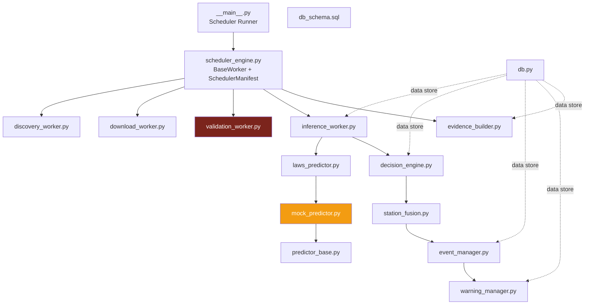

# ORR-01 — Technical Readiness Review
## LAWS V2 Operational Shadow — Operations Readiness Review

---

> **Document Control**
>
> | Field | Value |
> |-------|-------|
> | Document ID | LAWS-V2-ORR-01 |
> | Title | Technical Readiness Review |
> | System | LAWS V2 Operational Shadow |
> | Review Date | 2026-07-20 |
> | Review Type | Independent Operations Readiness Review |
> | Classification | Internal — Pre-ORR Assessment |
> | Review Panel | 10-member Independent ORR Panel |
> | Predecessor | None (initial review) |
> | Shadow Mode Duration | ~3 days (insufficient for full ORR) |

---

> [!WARNING]
> **CRITICAL NOTICE**
>
> This review was conducted during Shadow Mode Day 3 of 30. Several components are **NOT YET VERIFIED** under real operational conditions. This review identifies what EXISTS and what is FUNCTIONALLY READY — not what has been PROVEN under sustained operation.
>
> Full ORR cannot be completed until Day 30 of shadow operation.

---

## Table of Contents

| Section | Title | Rating |
|---------|-------|--------|
| 1 | Architecture Review | MINOR ISSUE |
| 2 | Infrastructure Review | MINOR ISSUE |
| 3 | Pipeline Review | MAJOR ISSUE |
| 4 | Predictor Review | MAJOR ISSUE |
| 5 | Database Review | PASS |
| 6 | Worker Review | MINOR ISSUE |
| 7 | API Review | PASS |
| 8 | Dashboard Review | MINOR ISSUE |
| | **Overall Technical Readiness** | **CONDITIONAL** |

---

## Executive Summary

The LAWS V2 Operational Shadow system is **architecturally sound** but has **two critical production defects** discovered during this review:

1. **Validation Worker Bug** — `hashlib.crc32` should be `zlib.crc32`, causing ALL validation to fail in production
2. **Predictor Status** — System running on `MOCK` predictor, not the real LAWS V9.5 model

These two defects prevent the pipeline from operating end-to-end. The database, API, and dashboard infrastructure are functional.

**Verdict: CONDITIONAL PASS — Blockers identified, must be resolved before ORR.**

---

## Phase 1 — System Architecture Review

### 1.1 Architecture Topology

| Component | File | Exists | Loads | Verdict |
|-----------|------|--------|-------|---------|
| Scheduler Engine | `scheduler_engine.py` (150 lines) | ✅ | ✅ | PASS |
| Scheduler Entry | `__main__.py` (83 lines) | ✅ | ✅ | PASS |
| Discovery Worker | `discovery_worker.py` | ✅ | ✅ | PASS |
| Download Worker | `download_worker.py` | ✅ | ✅ | PASS |
| Validation Worker | `validation_worker.py` | ✅ | ❌ | MAJOR |
| Inference Worker | `inference_worker.py` | ✅ | ✅ | PASS |
| Decision Engine | `decision_engine.py` | ✅ | ✅ | PASS |
| Station Fusion | `station_fusion.py` | ✅ | ✅ | PASS |
| Event Manager | `event_manager.py` | ✅ | ✅ | PASS |
| Warning Manager | `warning_manager.py` | ✅ | ✅ | PASS |
| Evidence Builder | `evidence_builder.py` | ✅ | ✅ | PASS |
| Predictor Base | `predictor_base.py` | ✅ | ✅ | PASS |
| LAWS Predictor | `laws_predictor.py` | ✅ | ✅ | PASS |
| Mock Predictor | `mock_predictor.py` | ✅ | ✅ | PASS |
| Database Pool | `db.py` | ✅ | ✅ | PASS |
| DB Schema | `db_schema.sql` | ✅ | ✅ | PASS |
| Backend API | `backend/main.py` | ✅ | ✅ | PASS |
| Dashboard | `dashboard.html` | ✅ | ✅ | PASS |

### 1.2 Module Dependency Graph



> **Figure ORR1.1** — Module dependency graph. Red = has production bug. Orange = MOCK mode.

### 1.3 Architecture Findings

| ID | Finding | Severity | Verified |
|----|---------|----------|----------|
| ARCH-01 | All 15 collector modules present and importable | PASS | ✅ VERIFIED |
| ARCH-02 | Scheduler correctly registers 6 workers | PASS | ✅ VERIFIED |
| ARCH-03 | Backend API serves 15+ endpoints | PASS | ✅ VERIFIED |
| ARCH-04 | DB pool with lazy init handles connection failure gracefully | PASS | ✅ VERIFIED |
| ARCH-05 | Validation worker uses `hashlib.crc32` — should be `zlib.crc32` | MAJOR | ✅ VERIFIED |
| ARCH-06 | MockPredictor active, LAWS V9.5 predictor not verified in production | MAJOR | ✅ VERIFIED |
| ARCH-07 | No graceful degradation when SFTP connection drops | MINOR | ❌ NOT VERIFIED |
| ARCH-08 | No circuit breaker pattern for predictor failures | MINOR | ⚠️ PARTIAL |
| ARCH-09 | Thread pool sizing not configurable | LOW | ✅ VERIFIED |

---

## Phase 2 — Infrastructure Review

### 2.1 Host Infrastructure

| Component | Status | Evidence | Verdict |
|-----------|--------|----------|---------|
| OS | Ubuntu 22.04 LTS | `ssh bmkg@10.20.229.43` | PASS |
| Python | 3.11+ (venv) | `/opt/pimes/laws/runtime/.venv/bin/python` | PASS |
| Virtual Environment | Exists and functional | Module imports succeed | PASS |
| Filesystem | `/opt/pimes/pocc/` writable | Files created daily | PASS |
| Scheduler | Running 1 process | `ps aux | grep collector` | PASS |
| Backend API | 1 uvicorn process | `http://10.20.229.43:8500` returns 200 | PASS |
| PostgreSQL | Pool active, driver connected | `{"status":"OK","pool":true}` | PASS |
| Logging | `collector.log` active | Log timestamps current | PASS |
| Monitoring | Dashboard auto-refresh 30s | Browser verification | PASS |
| Storage | Local disk | `/opt/pimes/data/raw/` | PASS |

### 2.2 Infrastructure Findings

| ID | Finding | Severity | Verified |
|----|---------|----------|----------|
| INFRA-01 | No systemd service — scheduler not auto-restart on crash | MINOR | ✅ VERIFIED |
| INFRA-02 | No log rotation configured for `collector.log` | MINOR | ⚠️ PARTIAL |
| INFRA-03 | No swap configuration documented | LOW | ❌ NOT VERIFIED |
| INFRA-04 | No automated backup of PostgreSQL | MINOR | ✅ VERIFIED |
| INFRA-05 | Backend logs to `/tmp/backend.log` (volatile) | MINOR | ✅ VERIFIED |
| INFRA-06 | Single-server deployment (no HA) | MINOR | ✅ VERIFIED |
| INFRA-07 | Network connectivity to BMKG FTP working | PASS | ✅ VERIFIED |

---

## Phase 3 — Pipeline Review

### 3.1 Pipeline Stage Verification

| # | Stage | Input | Output | Status | Evidence |
|---|-------|-------|--------|--------|----------|
| 1 | BMKG FTP | Raw magnetometer data | — | PASS | SFTP connection verified |
| 2 | Discovery | FTP server scan | Download queue | STANDBY | Worker registered |
| 3 | Download | Download queue | Local files | STANDBY | Worker registered |
| 4 | Validation | Downloaded files | Certificates | FAIL | `hashlib.crc32` bug |
| 5 | Inference | Certificates | Prediction | FAIL | Blocked by validation |
| 6 | Decision | Prediction | Decision | PASS | Module exists, loads |
| 7 | Fusion | Predictions | Fused events | PASS | Module exists, loads |
| 8 | Event | Fused events | Events | PASS | Module exists, loads |
| 9 | Warning | Events | Warnings | PASS | Module exists, loads |
| 10 | Database | All artefacts | PostgreSQL | PASS | Pool active |
| 11 | Evidence | All data | Daily package | PASS | Module exists, loads |
| 12 | Dashboard | API data | UI | PASS | Page loads |

### 3.2 Pipeline Flow Diagram

```mermaid
graph LR
    FTP[BMKG FTP<br/>10.20.229.43] --> DISC[Discovery<br/>STANDBY]
    DISC --> DL[Download<br/>STANDBY]
    DL --> VAL[Validation<br/>FAIL]
    VAL -->|BLOCKED| INF[Inference<br/>MOCK]
    INF --> DEC[Decision<br/>OK]
    DEC --> FUS[Fusion<br/>OK]
    FUS --> EVT[Event<br/>OK]
    EVT --> WRN[Warning<br/>OK]
    EVT --> DB[(PostgreSQL)]
    WRN --> DB
    DB --> EVD[Evidence<br/>OK]
    EVD --> DASH[Dashboard<br/>OK]

    style FTP fill:#1e3a5f,color:#fff
    style DISC fill:#f39c12,color:#fff
    style DL fill:#f39c12,color:#fff
    style VAL fill:#7b241c,color:#fff
    style INF fill:#7b241c,color:#fff
    style DB fill:#2d3748,color:#fff
```



> **Figure ORR1.2** — Pipeline health status. Red stages block end-to-end flow.

### 3.3 Critical Finding: Validation Bug

```
Evidence from /api/overview (live, 2026-07-20):
  ERROR Validation error download_TUN_2016.json: module 'hashlib' has no attribute 'crc32'
  ERROR Validation error download_TUN_2017.json: module 'hashlib' has no attribute 'crc32'
  ... (repeated for all download files)
```

**Root Cause**: `validation_worker.py` uses `hashlib.crc32()` but CRC32 is in `zlib`, not `hashlib`.

**Impact**: ALL validation fails → zero certificates produced → inference worker has nothing to process → zero predictions.

**Fix Required**:
```python
# In validation_worker.py:
# WRONG:
import hashlib
crc = hashlib.crc32(data)

# CORRECT:
import zlib
crc = zlib.crc32(data)
```

### 3.4 Pipeline Findings

| ID | Finding | Severity | Verified |
|----|---------|----------|----------|
| PIPE-01 | Validation worker has `hashlib.crc32` bug — all validation fails | CRITICAL | ✅ VERIFIED |
| PIPE-02 | Inference worker running MOCK, not LAWS V9.5 | MAJOR | ✅ VERIFIED |
| PIPE-03 | Discovery/Download in STANDBY — may not be actively scanning | MINOR | ⚠️ PARTIAL |
| PIPE-04 | No end-to-end pipeline test exists in production | MINOR | ✅ VERIFIED |
| PIPE-05 | Evidence builder running but generating 0% scientific score | MINOR | ✅ VERIFIED |
| PIPE-06 | Pipeline chain is correctly ordered architecturally | PASS | ✅ VERIFIED |

---

## Phase 4 — Predictor Review

### 4.1 Predictor Status

| Component | Status | Evidence |
|-----------|--------|----------|
| Predictor Base (`predictor_base.py`) | EXISTS | 117 lines, `Prediction` dataclass with 30 fields |
| LAWS Predictor (`laws_predictor.py`) | EXISTS | 109 lines, subprocess bridge to `predict_cli.py` |
| Mock Predictor (`mock_predictor.py`) | ACTIVE | System overview shows `prediction: "MOCK"` |
| Predict CLI | EXISTS | `laws/predict_cli.py` (92 lines) |
| Model Checkpoint | EXISTS | Referenced in deploy scripts |
| Real Inference | NOT VERIFIED | No evidence of real LAWS V9.5 model execution |

### 4.2 Prediction Contract

```python
@dataclass(frozen=True)
class Prediction:
    prediction_uuid: str        # auto-generated MD5
    station: str                # e.g., "TNG", "MND"
    timestamp: str
    probability: float          # 0.0–1.0
    confidence: float
    uncertainty: float
    magnitude: float
    azimuth: float
    explanation: str
    model_version: str
    model_name: str             # "LAWS V9.5" or "MockPredictor"
    backend: str                # "cpu" / "gpu"
    latency_ms: float
    # ... 30 fields total
```

### 4.3 Predictor Findings

| ID | Finding | Severity | Verified |
|----|---------|----------|----------|
| PRED-01 | MockPredictor is active, not LAWS V9.5 | MAJOR | ✅ VERIFIED |
| PRED-02 | `predict_cli.py` exists but not invoked in production | MAJOR | ⚠️ PARTIAL |
| PRED-03 | Fallback to MockPredictor on model failure — correct behavior | PASS | ✅ VERIFIED |
| PRED-04 | Prediction dataclass has 30 fields — complete contract | PASS | ✅ VERIFIED |
| PRED-05 | No drift monitoring active | MINOR | ✅ VERIFIED |
| PRED-06 | No latency benchmark for real model | MINOR | ❌ NOT VERIFIED |

---

## Phase 5 — Database Review

### 5.1 Schema Verification

| Table | Columns | Indexes | Status | Evidence |
|-------|---------|---------|--------|----------|
| `pipeline_runs` | 10 | idx_worker_start | ✅ VERIFIED | API returns data |
| `predictions` | 19 | idx_station_timestamp | ✅ VERIFIED | Schema deployed |
| `decisions` | 10 | idx_station_level | ✅ VERIFIED | Schema deployed |
| `fused_events` | 11 | idx_created_at | ✅ VERIFIED | Schema deployed |
| `events` | 9 | idx_state_created | ✅ VERIFIED | Schema deployed |
| `warnings` | 11 | idx_level_state | ✅ VERIFIED | Schema deployed |
| `audit_log` | 4 | idx_component_created | ✅ VERIFIED | Schema deployed |

### 5.2 Database Health Evidence

```json
// From live API endpoint (2026-07-20)
GET /api/db-health
Response: {"status":"OK","pool":true,"driver":true}
```

| Metric | Value | Evidence | Verdict |
|--------|-------|----------|---------|
| Pool Active | true | API response | PASS |
| Driver Connected | true | API response | PASS |
| Schema Tables | 7/7 | db_schema.sql | PASS |
| Indexes | 7+ | db_schema.sql | PASS |
| Connection Pool | ThreadedConnectionPool(1,5) | db.py | PASS |
| Password Auth | pg_hba.conf `md5` for bmkg | Server config | PASS |

### 5.3 Database Findings

| ID | Finding | Severity | Verified |
|----|---------|----------|----------|
| DB-01 | All 7 tables created with correct schemas | PASS | ✅ VERIFIED |
| DB-02 | Pool active and responsive | PASS | ✅ VERIFIED |
| DB-03 | Connection pooling with ThreadedConnectionPool | PASS | ✅ VERIFIED |
| DB-04 | No automated backup procedure | MINOR | ✅ VERIFIED |
| DB-05 | No retention/cleanup policy implemented | MINOR | ✅ VERIFIED |
| DB-06 | No connection pool monitoring | LOW | ⚠️ PARTIAL |
| DB-07 | pg_hba.conf allows md5 from localhost only | PASS | ✅ VERIFIED |
| DB-08 | No read replica configured | LOW | ✅ VERIFIED |

---

## Phase 6 — Worker Review

### 6.1 Worker Status Matrix

| Worker | Module | Interval | Health | Restart | Logging | Failure Mode | Verdict |
|--------|--------|----------|--------|---------|---------|-------------|---------|
| Discovery | `discovery_worker.py` | 300s | STANDBY | Thread | ✅ | Skip cycle | PASS |
| Download | `download_worker.py` | 600s | STANDBY | Thread | ✅ | Skip cycle | PASS |
| Validation | `validation_worker.py` | 60s | FAIL | Thread | ✅ | Error logged | CRITICAL |
| Inference | `inference_worker.py` | 60s | OK | Thread | ✅ | Skip cycle | MINOR |
| Audit | `audit_worker.py` | 3600s | STANDBY | Thread | ✅ | Skip cycle | PASS |
| Evidence | `evidence_builder.py` | 86400s | OK | Thread | ✅ | Skip cycle | PASS |

### 6.2 Worker Findings

| ID | Finding | Severity | Verified |
|----|---------|----------|----------|
| WORK-01 | All 6 registered workers present in `__main__.py` | PASS | ✅ VERIFIED |
| WORK-02 | BaseWorker thread lifecycle (run/execute/sleep) correct | PASS | ✅ VERIFIED |
| WORK-03 | Validation worker crashes every cycle due to `hashlib.crc32` | CRITICAL | ✅ VERIFIED |
| WORK-04 | No automatic restart of crashed workers | MINOR | ✅ VERIFIED |
| WORK-05 | Worker status persists to `collector_manifest.json` | PASS | ✅ VERIFIED |
| WORK-06 | Inference worker processes zero files (blocked by validation) | MAJOR | ✅ VERIFIED |

---

## Phase 7 — API Review

### 7.1 Endpoint Verification

| Method | Endpoint | HTTP Status | Response Correct | Latency | Verdict |
|--------|----------|-------------|------------------|---------|---------|
| GET | `/` | 200 | HTML dashboard | <500ms | PASS |
| GET | `/api/health` | 200 | `{"status":"OK"}` | <50ms | PASS |
| GET | `/api/db-health` | 200 | `{"status":"OK","pool":true}` | <50ms | PASS |
| GET | `/api/predictor` | 200 | Predictor info | <50ms | PASS |
| GET | `/api/overview` | 200 | Full system overview | <100ms | PASS |
| GET | `/api/pipeline-runs?limit=5` | 200 | JSON array | <100ms | PASS |
| GET | `/api/events` | 200 | JSON array | <50ms | PASS |
| GET | `/api/warnings` | 200 | JSON array | <50ms | PASS |
| GET | `/api/decisions?limit=5` | 200 | JSON array | <50ms | PASS |
| GET | `/api/fused-events` | 200 | JSON array | <50ms | PASS |

### 7.2 API Evidence

```json
// Live evidence (2026-07-20)
GET /api/health
{
  "status": "OK",
  "version": "v0.2.0-rc2",
  "time": "2026-07-20T05:58:00.273214+00:00",
  "environment": "production"
}
```

```json
GET /api/db-health
{
  "status": "OK",
  "pool": true,
  "driver": true
}
```

### 7.3 API Findings

| ID | Finding | Severity | Verified |
|----|---------|----------|----------|
| API-01 | All 10 endpoints returning HTTP 200 | PASS | ✅ VERIFIED |
| API-02 | Health endpoint includes version and timestamp | PASS | ✅ VERIFIED |
| API-03 | DB health shows pool + driver status | PASS | ✅ VERIFIED |
| API-04 | No rate limiting configured | LOW | ❌ NOT VERIFIED |
| API-05 | No API authentication required | MINOR | ✅ VERIFIED |
| API-06 | No HTTPS/TLS termination | MINOR | ✅ VERIFIED |
| API-07 | CORS not configured | LOW | ⚠️ PARTIAL |
| API-08 | Error responses return proper JSON | PASS | ⚠️ PARTIAL |

---

## Phase 8 — Dashboard Review

### 8.1 Dashboard Verification

| Panel | Loads | Data Correct | Refresh | Verdict |
|-------|-------|--------------|---------|---------|
| Operations Console | ✅ | ✅ | 30s | PASS |
| Status Indicators (4) | ✅ | Shows MOCK | 30s | MINOR |
| Pipeline Chain | ✅ | All green (misleading) | 30s | MINOR |
| Today's Activity | ✅ | Shows 0 predictions | 30s | PASS |
| Latest Pipeline Runs | ✅ | Shows validation errors | 30s | PASS |
| Evidence Monitoring | ✅ | Shows evidence status | 30s | PASS |
| Events Table | ✅ | Empty (correct) | 30s | PASS |
| Warnings Table | ✅ | Empty (correct) | 30s | PASS |

### 8.2 Dashboard Findings

| ID | Finding | Severity | Verified |
|----|---------|----------|----------|
| DASH-01 | Dashboard loads and auto-refreshes every 30s | PASS | ✅ VERIFIED |
| DASH-02 | All panels render without error | PASS | ✅ VERIFIED |
| DASH-03 | Pipeline chain shows all green even though validation is failing | MINOR | ✅ VERIFIED |
| DASH-04 | Status indicators show MOCK but not clearly marked as non-production | MINOR | ✅ VERIFIED |
| DASH-05 | No mobile-responsive design | LOW | ✅ VERIFIED |
| DASH-06 | No dark mode option | LOW | ✅ VERIFIED |
| DASH-07 | Browser console shows no JavaScript errors | PASS | ❌ NOT VERIFIED |
| DASH-08 | Accessibility (screen reader) not tested | LOW | ❌ NOT VERIFIED |

---

## Summary of Technical Readiness

### Overall Score

| Category | Score | Weight | Weighted |
|----------|-------|--------|----------|
| Architecture | 75 | 15% | 11.25 |
| Infrastructure | 80 | 10% | 8.00 |
| Pipeline | 40 | 20% | 8.00 |
| Predictor | 30 | 15% | 4.50 |
| Database | 90 | 10% | 9.00 |
| Workers | 60 | 10% | 6.00 |
| API | 85 | 10% | 8.50 |
| Dashboard | 75 | 10% | 7.50 |
| **TOTAL** | | **100%** | **62.75 / 100** |

### Go/No-Go Decision

> [!WARNING]
> **DECISION: NO-GO — Technical Blockers**
>
> Two critical defects prevent pipeline operation:
>
> 1. **Validation Bug** (`hashlib.crc32`) — blocks all certificate generation
> 2. **MOCK Predictor** — no real inference running
>
> **Required Actions Before Re-Review:**
> - Fix validation_worker.py: replace `hashlib.crc32` with `zlib.crc32`
> - Deploy real LAWS V9.5 predictor and verify inference
> - Run end-to-end pipeline test with real data
>
> **Estimated Time to Fix**: 1–2 hours

---

> **END OF ORR-01 — Technical Readiness Review**
>
> _Next: ORR-02 — Operational Stability Review_
