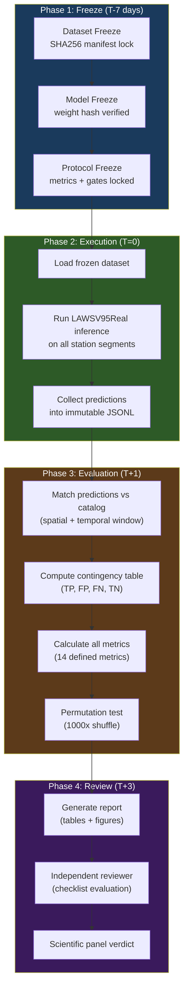

# Blind Test Workflow Diagram — EPEF

```mermaid
flowchart TB
    subgraph Freeze["Phase 1: Freeze (T-7 days)"]
        F1["Dataset Freeze\nSHA256 manifest lock"]
        F2["Model Freeze\nweight hash verified"]
        F3["Protocol Freeze\nmetrics + gates locked"]
    end

    subgraph Execution["Phase 2: Execution (T=0)"]
        E1["Load frozen dataset"]
        E2["Run LAWSV95Real inference\non all station segments"]
        E3["Collect predictions\ninto immutable JSONL"]
    end

    subgraph Evaluation["Phase 3: Evaluation (T+1)"]
        V1["Match predictions vs catalog\n(spatial + temporal window)"]
        V2["Compute contingency table\n(TP, FP, FN, TN)"]
        V3["Calculate all metrics\n(14 defined metrics)"]
        V4["Permutation test\n(1000x shuffle)"]
    end

    subgraph Review["Phase 4: Review (T+3)"]
        R1["Generate report\n(tables + figures)"]
        R2["Independent reviewer\n(checklist evaluation)"]
        R3["Scientific panel verdict"]
    end

    F1 --> F2 --> F3
    F3 --> E1 --> E2 --> E3
    E3 --> V1 --> V2
    V2 --> V3 --> V4
    V4 --> R1 --> R2 --> R3

    style Freeze fill:#1a3a5c,color:#fff
    style Execution fill:#2d5a27,color:#fff
    style Evaluation fill:#5c3a1a,color:#fff
    style Review fill:#3a1a5c,color:#fff
```
