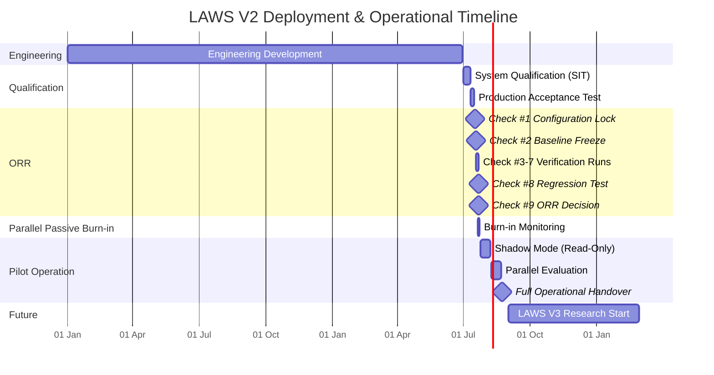

# Deployment Timeline Diagram — BMKG

```mermaid
gantt
    title LAWS V2 Deployment & Operational Timeline
    dateFormat  YYYY-MM-DD
    axisFormat  %d %b

    section Engineering
    Engineering Development           :2025-01-01, 2026-06-30

    section Qualification
    System Qualification (SIT)        :2026-07-01, 2026-07-10
    Production Acceptance Test        :2026-07-11, 2026-07-15

    section ORR
    Check #1 Configuration Lock       :milestone, 2026-07-17, 0d
    Check #2 Baseline Freeze          :milestone, 2026-07-18, 0d
    Check #3-7 Verification Runs      :2026-07-18, 2026-07-22
    Check #8 Regression Test          :milestone, 2026-07-22, 0d
    Check #9 ORR Decision             :milestone, 2026-07-22, 0d

    section Parallel Passive Burn-in
    Burn-in Monitoring                :2026-07-21, 2026-07-23

    section Pilot Operation
    Shadow Mode (Read-Only)           :2026-07-24, 2026-08-07
    Parallel Evaluation               :2026-08-08, 2026-08-22
    Full Operational Handover         :milestone, 2026-08-23, 0d

    section Future
    LAWS V3 Research Start            :2026-09-01, 180d
```
