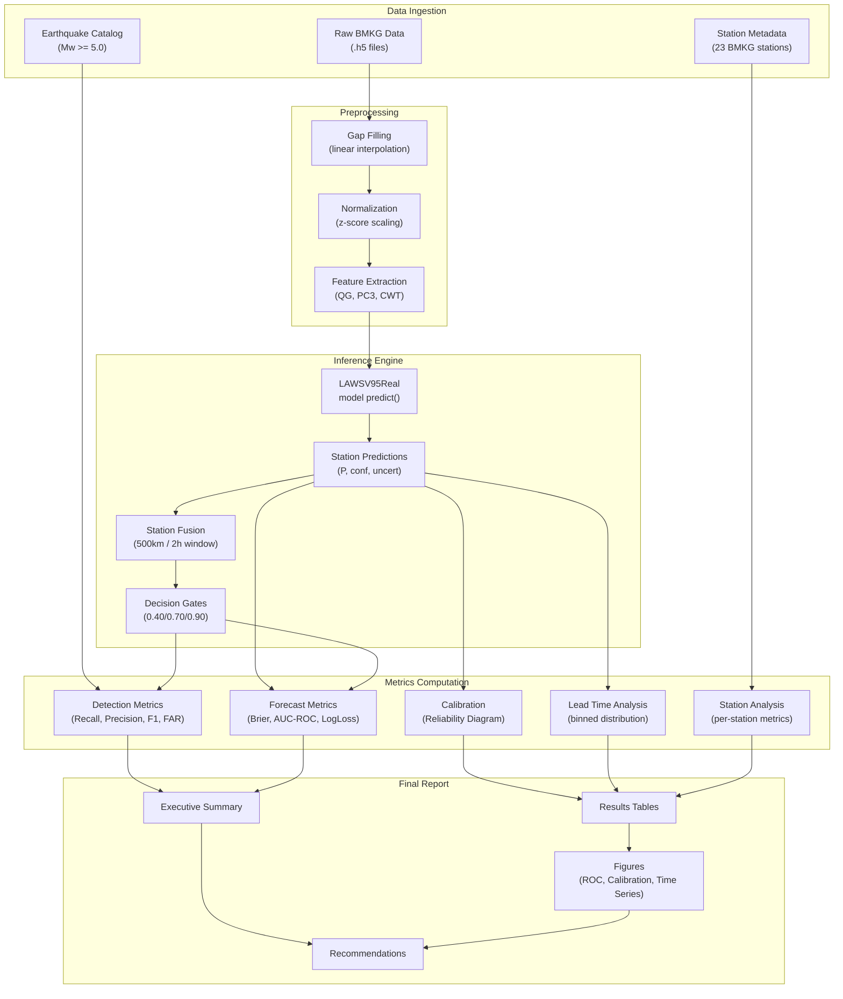

# Evaluation Pipeline Diagram — EPEF

```mermaid
flowchart TB
    subgraph Input["Data Ingestion"]
        A1["Raw BMKG Data\n(.h5 files)"]
        A2["Earthquake Catalog\n(Mw >= 5.0)"]
        A3["Station Metadata\n(23 BMKG stations)"]
    end

    subgraph Preprocess["Preprocessing"]
        B1["Gap Filling\n(linear interpolation)"]
        B2["Normalization\n(z-score scaling)"]
        B3["Feature Extraction\n(QG, PC3, CWT)"]
    end

    subgraph Inference["Inference Engine"]
        C1["LAWSV95Real\nmodel predict()"]
        C2["Station Predictions\n(P, conf, uncert)"]
        C3["Station Fusion\n(500km / 2h window)"]
        C4["Decision Gates\n(0.40/0.70/0.90)"]
    end

    subgraph Metrics["Metrics Computation"]
        D1["Detection Metrics\n(Recall, Precision, F1, FAR)"]
        D2["Forecast Metrics\n(Brier, AUC-ROC, LogLoss)"]
        D3["Calibration\n(Reliability Diagram)"]
        D4["Lead Time Analysis\n(binned distribution)"]
        D5["Station Analysis\n(per-station metrics)"]
    end

    subgraph Report["Final Report"]
        E1["Executive Summary"]
        E2["Results Tables"]
        E3["Figures\n(ROC, Calibration, Time Series)"]
        E4["Recommendations"]
    end

    A1 --> B1 --> B2 --> B3 --> C1 --> C2
    A2 --> D1
    A3 --> D5
    C2 --> C3 --> C4 --> D1
    C2 --> D2
    C4 --> D2
    C2 --> D3
    C2 --> D4
    D1 --> E1
    D2 --> E1
    D3 --> E2
    D4 --> E2
    D5 --> E2
    E1 --> E4
    E2 --> E3 --> E4
```
