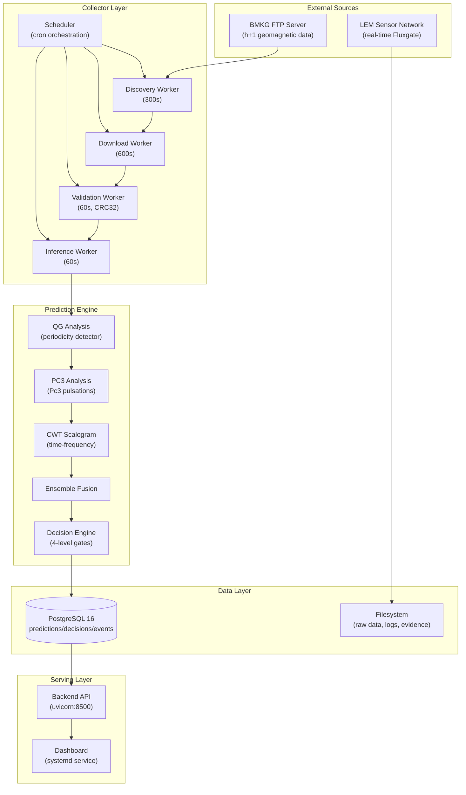
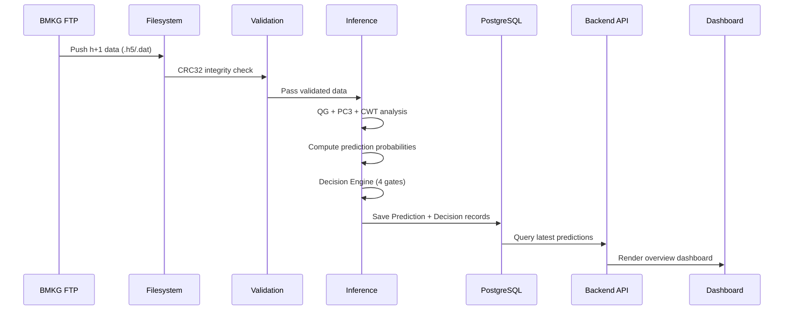
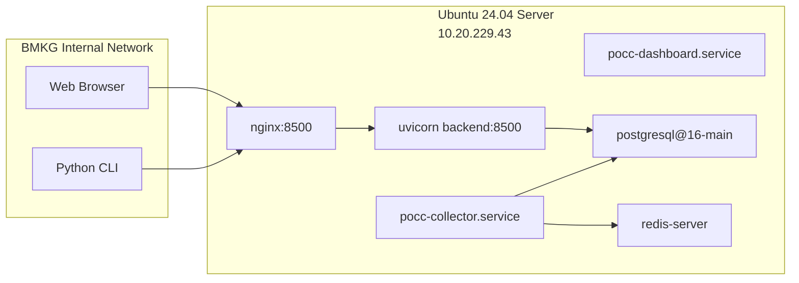

# System Architecture Diagrams — LAWS V2

## 1. High-Level System Architecture

```mermaid
graph TB
    subgraph External["External Sources"]
        BMKG_FTP["BMKG FTP Server\n(h+1 geomagnetic data)"]
        LEM["LEM Sensor Network\n(real-time Fluxgate)"]
    end

    subgraph Collector["Collector Layer"]
        DISC["Discovery Worker\n(300s)"]
        DL["Download Worker\n(600s)"]
        VAL["Validation Worker\n(60s, CRC32)"]
        INF["Inference Worker\n(60s)"]
        SCHED["Scheduler\n(cron orchestration)"]
    end

    subgraph Predictor["Prediction Engine"]
        QG["QG Analysis\n(periodicity detector)"]
        PC3["PC3 Analysis\n(Pc3 pulsations)"]
        CWT["CWT Scalogram\n(time-frequency)"]
        ENS["Ensemble Fusion"]
        DEC["Decision Engine\n(4-level gates)"]
    end

    subgraph Storage["Data Layer"]
        PG[("PostgreSQL 16\npredictions/decisions/events")]
        FS["Filesystem\n(raw data, logs, evidence)"]
    end

    subgraph API["Serving Layer"]
        BACKEND["Backend API\n(uvicorn:8500)"]
        DASHBOARD["Dashboard\n(systemd service)"]
    end

    BMKG_FTP --> DISC --> DL --> VAL --> INF
    LEM --> FS
    INF --> QG --> PC3 --> CWT --> ENS --> DEC
    DEC --> PG
    PG --> BACKEND
    BACKEND --> DASHBOARD
    SCHED --> DISC
    SCHED --> DL
    SCHED --> VAL
    SCHED --> INF
```

## 2. Data Flow Pipeline

```mermaid
sequenceDiagram
    participant FTP as BMKG FTP
    participant FS as Filesystem
    participant VAL as Validation
    participant INF as Inference
    participant PG as PostgreSQL
    participant API as Backend API
    participant DASH as Dashboard

    FTP->>FS: Push h+1 data (.h5/.dat)
    FS->>VAL: CRC32 integrity check
    VAL->>INF: Pass validated data
    INF->>INF: QG + PC3 + CWT analysis
    INF->>INF: Compute prediction probabilities
    INF->>INF: Decision Engine (4 gates)
    INF->>PG: Save Prediction + Decision records
    PG->>API: Query latest predictions
    API->>DASH: Render overview dashboard
```

## 3. Deployment Topology (Ubuntu Server)

```mermaid
graph LR
    subgraph VM["Ubuntu 24.04 Server\n10.20.229.43"]
        NGINX["nginx:8500"]
        UVICORN["uvicorn backend:8500"]
        DASH_SVC["pocc-dashboard.service"]
        COLL_SVC["pocc-collector.service"]
        PG16["postgresql@16-main"]
        REDIS["redis-server"]
        
        NGINX --> UVICORN
        UVICORN --> PG16
        COLL_SVC --> PG16
        COLL_SVC --> REDIS
    end

    subgraph Client["BMKG Internal Network"]
        BROWSER["Web Browser"]
        CLI["Python CLI"]
    end

    BROWSER --> NGINX
    CLI --> NGINX
```
