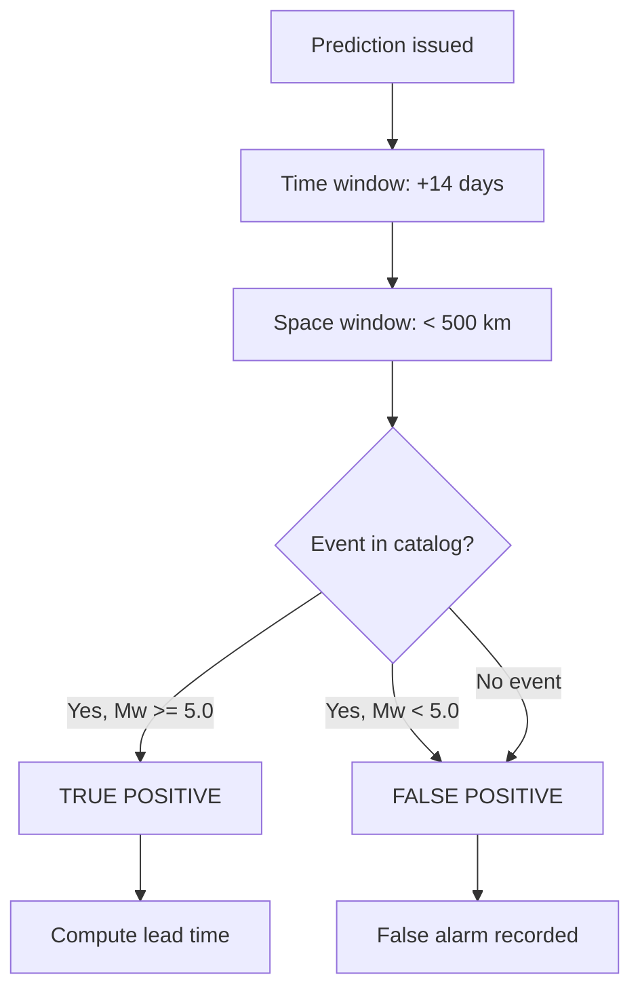

# Detection Metrics — EPEF V1.0

## 1. Ground-Truth Matching Logic

## 2. Contingency Table

| | Event Observed | No Event |
|---|---|---|
| **Predicted** | TP | FP |
| **Not Predicted** | FN | TN |

## 3. Core Metrics

### 3.1 Detection Rate (Recall)
\[
\text{Recall} = \frac{TP}{TP + FN}
\]

### 3.2 Precision
\[
\text{Precision} = \frac{TP}{TP + FP}
\]

### 3.3 F1 Score
\[
F_1 = 2 \cdot \frac{P \cdot R}{P + R}
\]

### 3.4 False Alarm Rate
\[
\text{FAR} = \frac{FP}{TP + FP}
\]

### 3.5 Miss Rate
\[
\text{Miss} = \frac{FN}{TP + FN} = 1 - \text{Recall}
\]

### 3.6 Critical Success Index (CSI)
\[
\text{CSI} = \frac{TP}{TP + FP + FN}
\]

### 3.7 Probability of Detection (POD)
\[
\text{POD} = \frac{TP}{TP + FN}
\]

### 3.8 Heidke Skill Score (HSS)
\[
\text{HSS} = \frac{2(TP \cdot TN - FP \cdot FN)}{(TP + FN)(FN + TN) + (TP + FP)(FP + TN)}
\]

### 3.9 Gilbert Skill Score (GSS)
\[
\text{GSS} = \frac{TP - TP_{\text{random}}}{TP - FP - FN + TP_{\text{random}}}
\]

---

## 4. Required Thresholds for Blind Test
| Metric | Threshold | Target |
|---|---|---|
| Recall | $\ge 0.60$ | $\ge 0.75$ |
| Precision | $\ge 0.40$ | $\ge 0.60$ |
| F1 | $\ge 0.40$ | $\ge 0.65$ |
| FAR | $\le 0.60$ | $\le 0.40$ |
| CSI | $\ge 0.30$ | $\ge 0.50$ |
| HSS | $\ge 0.40$ | $\ge 0.60$ |
