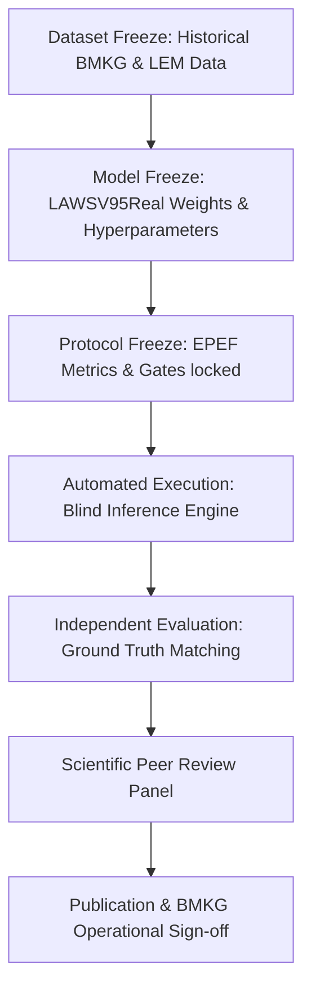

# Earthquake Prediction Evaluation Framework (EPEF)
## Protocol 1: Blind Test Protocol

### 1. Executive Summary
This document establishes the official **Blind Test Protocol** for the LAWS V2 (Precursor Earthquake Warning System) prior to any operational deployment. The protocol enforces strict separation between model development, dataset freeze, and prospective evaluation to ensure zero data leakage and uncompromised scientific integrity.

---

### 2. Operational Lifecycle & Freeze Sequence

#### 2.1 Stage 1 — Dataset Freeze
- **Scope**: Historical geomagnetic ($H, D, Z$ components), TEC (Total Electron Content), and seismicity catalog data covering target Indonesian subduction zones.
- **Verification**: SHA-256 checksum generated for all raw input HDF5/ASCII arrays.
- **Rule**: No updates, backfilling, or retroactive cleaning permitted post-freeze timestamp.

#### 2.2 Stage 2 — Model Freeze
- **Artifact**: Model binary `LAWSV95Real.pt` / `predict_cli.py` hash lock.
- **Rule**: Calibration parameters, feature normalization scaling vectors ($\mu, \sigma$), wavelets scales, and decision thresholds ($P_{\text{advisory}}=0.40, P_{\text{watch}}=0.70, P_{\text{warning}}=0.90$) are immutable.

#### 2.3 Stage 3 — Protocol Freeze
- **Definition**: Matching window ($T_{\text{lead}} \in [1, 14] \text{ days}$), spatial radius ($R_{\text{target}} \le 500\text{ km}$), magnitude cutoff ($M_w \ge 5.0$), and false alarm scoring rules locked.

---

### 3. Execution & Blind Evaluation Governance
1. **Runner**: Execution takes place using the local `predict_cli.py` engine on un-blinded evaluation slices.
2. **Auditing**: Every prediction output generates a cryptographic provenance record (`Prediction` dataclass with `prediction_hash`, `input_hash`, `qc_version`).
3. **No-Retries Rule**: Single-pass evaluation only. Any hyperparameter adjustment invalidates the entire blind run.

---

### 4. Verification & Audit Trail
| Step | Artifact Generated | Verification Method |
|---|---|---|
| Data Hash | `dataset_manifest.sha256` | `sha256sum -c` |
| Model Hash | `model_freeze.sha256` | `sha256sum predict_cli.py` |
| Output Log | `blind_predictions.jsonl` | Immutable log stream |
| Evaluation Summary | `blind_test_report.md` | EPEF Automated Verification Script |
