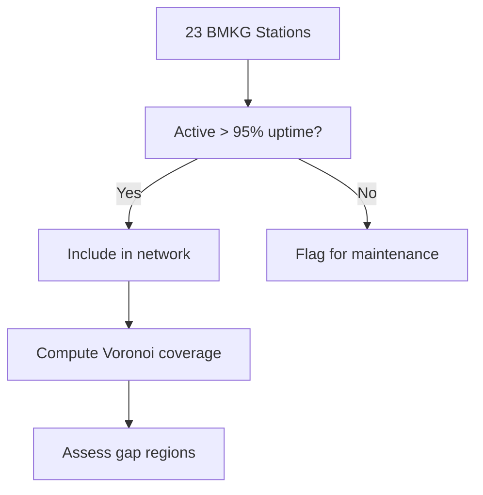

# Station Evaluation Protocol — EPEF V1.0

## 1. Station Scoring
Per-station metrics evaluate spatial reliability of predictions.

### 1.1 Station Availability
\[
A_s = \frac{T_{\text{up},s}}{T_{\text{total}}} \times 100
\]
Threshold: $A_s \ge 95\%$ for operational readiness.

### 1.2 Station Weights
Fusion weights based on historical skill:

\[
w_s = \frac{\text{F1}_s}{\sum_{s=1}^{N} \text{F1}_s}
\]

### 1.3 Cluster Analysis
Stations grouped by geographic proximity (haversine < 200 km). Cluster-level predictions:

\[
P_{\text{cluster}} = \frac{1}{N_c} \sum_{s=1}^{N_c} P_s
\]

---

## 2. Spatial Coverage Assessment

### 2.1 Coverage Metric
\[
C = \frac{A_{\text{covered}}}{A_{\text{target}}} \ge 0.80
\]

---

## 3. Multi-Station Fusion Evaluation

### 3.1 Fusion Gates
| Gate | Condition | Effect |
|---|---|---|
| Min Stations | $N \ge 2$ | Proceed |
| Probability | $\max(P_s) \ge 0.40$ | Alert |
| Consistency | $\sigma(P) < 0.30$ | Reliable |

### 3.2 Fusion Validation
Leave-one-station-out cross-validation to assess fusion robustness.
