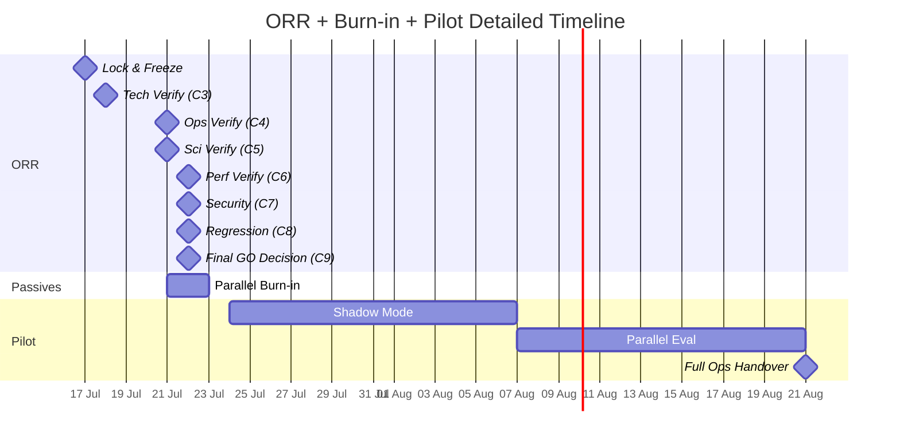

# ORR Timeline Diagram

```mermaid
timeline
    title LAWS V2 ORR Timeline

    section Phase 1: Initiation (17 Jul)
        Check 1 : Configuration Lock
        Check 2 : Baseline Freeze
                 : Burn-in Starts

    section Phase 2: Verification (18-22 Jul)
        Check 3 : Technology Verification
        Check 4 : Operations Verification : ~15:00 WITA 21 Jul
        Check 5 : Scientific Verification : ~21:00 WITA 21 Jul
        Check 6 : Performance Verification : ~03:00 WITA 22 Jul
        Check 7 : Security & Compliance : ~09:00 WITA 22 Jul

    section Phase 3: Acceptance (22 Jul)
        Check 8 : Regression Test : ~15:00 WITA 22 Jul
        Check 9 : Final Decision : ~21:00 WITA 22 Jul
                 : ORR Closure

    section Phase 4: Operations (24 Jul+)
        Pilot Shadow : 14 days passive
        Pilot Parallel : 14 days advisory
        Full Handover : 50-day milestone
```


