# Failure Taxonomy — EPEF V1.0

## 1. Failure Classification Tree

```mermaid
flowchart TD
    Failure["Prediction Failure"] --> FD["Detection Error"]
    Failure --> FT["Temporal Error"]
    Failure --> FS["Station Error"]
    Failure --> FSs["Storm / Space Weather"]
    Failure --> FDt["Data Quality"]

    FD --> FN["False Negative (Miss)\nevent exists, no alarm"]
    FD --> FP["False Positive\nalarm issued, no event"]

    FT --> ED["Early Detection\nlead time > 14 days"]
    FT --> LD["Late Detection\nlead time < 24 hours"]
    FT --> TS["Timing Shift\npredicted vs actual offset > 3 days"]

    FS --> SF["Station Failure\npredictor offline"]
    FS --> SD["Sensor Drift\ncalibration degraded"]
    FS --> SC["Coverage Gap\nno station within 500km"]

    FSs --> ST["Storm Contamination\nKp > 4"]
    FSs --> SW["Space Weather\nSEP / CME interference"]
    FSs --> DI["Diurnal Variation\nmisattributed anomaly"]

    FDt --> MQ["Missing Data\ngaps > 10%"]
    FDt --> CQ["Corrupted Data\nCRC32 mismatch"]
    FDt --> NQ["Noise Floor\nSNR < 3 dB"]
```



## 2. Classification Tags
Each failure SHOULD be tagged with one code from each group:

| Group | Code | Meaning |
|---|---|---|
| Detection | FN | Miss |
| Detection | FP | False Alarm |
| Temporal | ET | Early |
| Temporal | LT | Late |
| Temporal | TS | Timing Shift |
| Station | FAIL | Station Failure |
| Station | DRIFT | Sensor Drift |
| Station | COV | Coverage Gap |
| Storm | SOLAR | Solar Activity |
| Storm | KP | Kp Index |
| Storm | DIURNAL | Diurnal |
| Data | MISSING | Missing |
| Data | CORRUPT | Corrupted |
| Data | NOISE | Noise |
| Data | UNK | Unknown |

## 3. Example Classification

```text
Event 2023-06-15 M5.2:
  FP: Prediction P=0.65 at T-7d, 500km from any Mw>=5.0 within 14d
  Tags: [FP, TS, SOLAR]
  Notes: Kp=5.1, likely storm contamination
```
