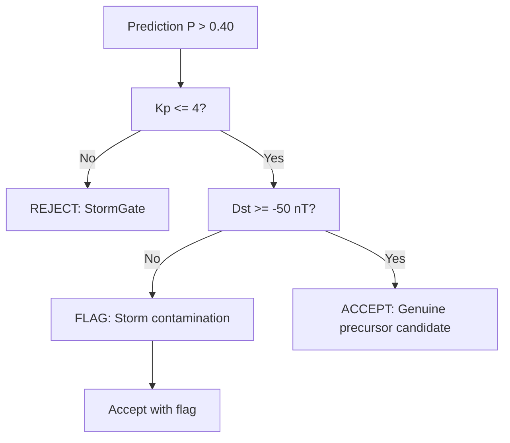

# Physics Validation Framework — LAWS V2

## 1. Polarization Analysis
Validate that geomagnetic polarization changes precede earthquakes.

### Z/H Ratio
\[
\text{Z/H} = \frac{|Z|}{|H|}
\]
- Theory: Z/H increases before earthquakes (conductivity change in crust)
- Validation: Compare Z/H ratio in pre-event window vs baseline for TP events

### Azimuth Deviation
- Compute dominant polarization angle from H, D components
- Expected: azimuth deviation from background prior to events

## 2. Pc3 Pulsation Behaviour
Pc3 pulsations (10-45s period) are associated with ULF wave activity.

### Validation Protocol
1. Band-pass filter data at 0.022-0.1 Hz
2. Compute envelope using Hilbert transform: $A(t) = |\text{Hilbert}(x(t))|$
3. Compare pre-event amplitude $A_{[-14, -1]\text{days}}$ vs baseline $A_{\text{background}}$
4. Expected: elevated amplitude preceding events

## 3. Solar Activity Control
Critical: distinguish geomagnetic precursors from solar-induced variations.

### Kp Index Analysis
| Kp Range | Interpretation | Action |
|---|---|---|
| 0-2 | Quiet | Standard operation |
| 3-4 | Active | Flag predictions with caution |
| > 4 | Storm | Suppress alerts (StormGate) |

### Validation
- Compute correlation: Kp vs prediction probability
- Expected: near-zero correlation after StormGate suppression

## 4. Dst Index Validation
Storm-time Disturbance index validation:

- Dst < -30 nT: geomagnetic storm
- Dst < -50 nT: moderate storm (likely FP source)
- Dst < -100 nT: major storm

Rule: If Dst < -50 nT within 48h of prediction → tag as "STORM_FLAG"

## 5. ULF Energy Analysis
Compute ULF energy in 0.01-0.1 Hz band:

\[
E_{\text{ULF}} = \frac{1}{T} \int_0^T |x(t)|^2 dt
\]

Compare cumulative energy in pre-event vs baseline windows.

## 6. Space Weather Rejection
Framework for rejecting false precursors from space weather:

