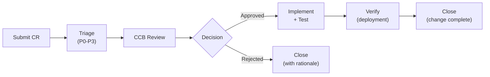

# Change Control — LAWS V2

## 1. Change Request (CR) Process



## 2. CR Template

```markdown
## CR-[NUMBER]

**Title**: [Brief description]
**Priority**: P0 | P1 | P2 | P3
**Type**: Bug fix | Feature | Config | Model | Schema
**Requested by**: [Name]
**Date**: [YYYY-MM-DD]

### Description
[What needs to change and why]

### Impact
- Affected components: [list]
- Risk level: Low | Medium | High
- Rollback complexity: Simple | Complex

### Evidence
[Data, logs, metrics supporting the need]

### Approval
- [ ] System Architect
- [ ] SRE Lead
- [ ] ML Lead
- [ ] BMKG Rep (for model/schema changes)
```

## 3. Change Freeze Periods
| Period | Scope | Duration |
|---|---|---|
| ORR | All production CIs | Duration of ORR checkpoints |
| Pilot | All production CIs | 28-day pilot window |
| Critical | All CIs | During incident response |

## 4. Emergency Change Process
For P0 incidents only:
1. System Architect approves verbally
2. Change implemented immediately
3. CR retroactively filed within 24h
4. CCB reviews emergency change within 48h
