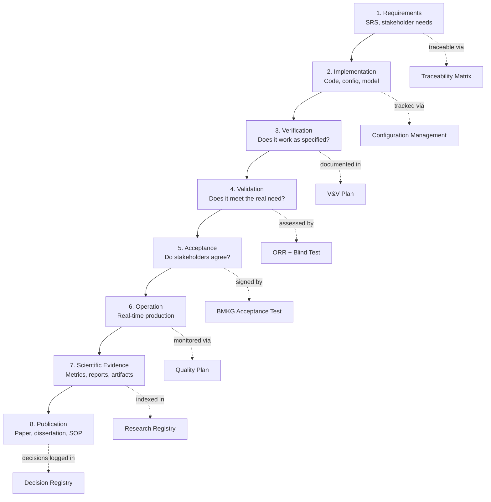

# LAWS Verification & Validation Framework (LVVF)

## 1. Purpose
LVVF is the umbrella governance framework connecting requirements, implementation, verification, validation, acceptance, operation, evidence, and publication for the LAWS V2 system.

## 2. Framework Architecture



## 3. Document Map

| ID | Document | Purpose | Owner |
|---|---|---|---|
| LVVF-01 | V&V_PLAN.md | Verification & Validation plan | System Architect |
| LVVF-02 | QUALITY_PLAN.md | Quality assurance procedures | SRE Lead |
| LVVF-03 | CONFIGURATION_MANAGEMENT.md | Config & change control | DevOps Lead |
| LVVF-04 | MODEL_LIFECYCLE.md | Model versioning & promotion | MLOps Lead |
| LVVF-05 | RELEASE_POLICY.md | Release gates & versioning | Release Manager |
| LVVF-06 | CHANGE_CONTROL.md | Change request workflow | Change Control Board |
| LVVF-07 | RISK_REGISTER.md | Risk identification & mitigation | Project Lead |
| LVVF-08 | DECISION_LOG.md | Key decision registry | All stakeholders |
| LVVF-09 | LESSONS_LEARNED.md | Retrospective findings | Project Lead |
| LVVF-10 | DECISION_REGISTRY.md | Structured decision tracking | System Architect |

## 4. How Documents Relate

```
REQUIREMENTS ──────→ SRS Document
    │
    ▼
IMPLEMENTATION ─────→ Source Code (Git)
    │                    │
    ▼                    ▼
VERIFICATION ───────→ V&V Plan (LVVF-01)
    │                    │
    ▼                    ▼
CONFIG CHANGE ──────→ Change Control (LVVF-06)
    │                    │
    ▼                    ▼
MODEL PROMOTION ────→ Model Lifecycle (LVVF-04)
    │
    ▼
VALIDATION ─────────→ ORR (C1-C9)
    │
    ▼
ACCEPTANCE ─────────→ BMKG Acceptance Test
    │
    ▼
OPERATION ──────────→ Quality Plan (LVVF-02)
    │
    ▼
EVIDENCE ───────────→ Research Registry + Decision Registry
    │
    ▼
PUBLICATION ────────→ Paper / Dissertation
```

## 5. Applicability
LVVF applies to:
- LAWS V2 (current production system)
- LAWS V2.5 (planned enhancements)
- LAWS V3 (next-generation platform)

## 6. Review Cycle
- Quarterly: Review risk register and lessons learned
- Per release: Update decision log, configuration management
- Per ORR: Full V&V cycle
- Annual: Framework version update
