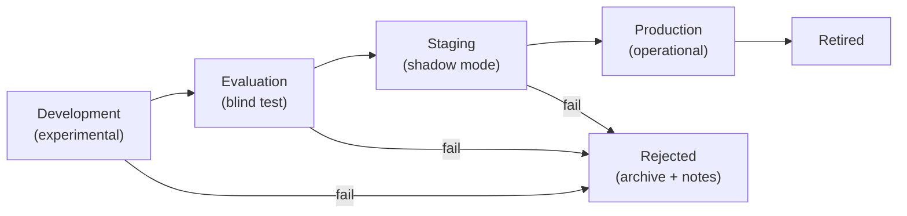

# Model Lifecycle — LAWS V2

## 1. Model Stages

## 2. Promotion Gates

| Transition | Gate | Evidence Required |
|---|---|---|
| Dev → Eval | Model freeze | Weight hash SHA-256 |
| Eval → Stage | Blind test metrics | F1 > 0.40, AUC > 0.70 |
| Stage → Prod | Pilot validation | 28-day prospective results |
| Prod → Retire | Successor deployed | New model ORR passed |

## 3. Model Registry

| Model ID | Version | Hash (SHA-256) | Date | Stage | Notes |
|---|---|---|---|---|---|
| LAWSV95Real | laws-v9.5-champion | [hash] | 2026-07 | PRODUCTION | Current champion |
| MockPredictor | v1.0 | N/A | 2026-01 | ARCHIVED | Testing only |

## 4. Rollback Policy
1. Previous production model hash always documented
2. Rollback: redeploy previous model binary
3. Rollback window: 72 hours
4. Rollback triggers: F1 drop > 20%, FAR spike > 50%, system instability

## 5. Model Deprecation
- Deprecated models listed in registry with retirement date
- 6-month archive retention
- No production use after deprecation
